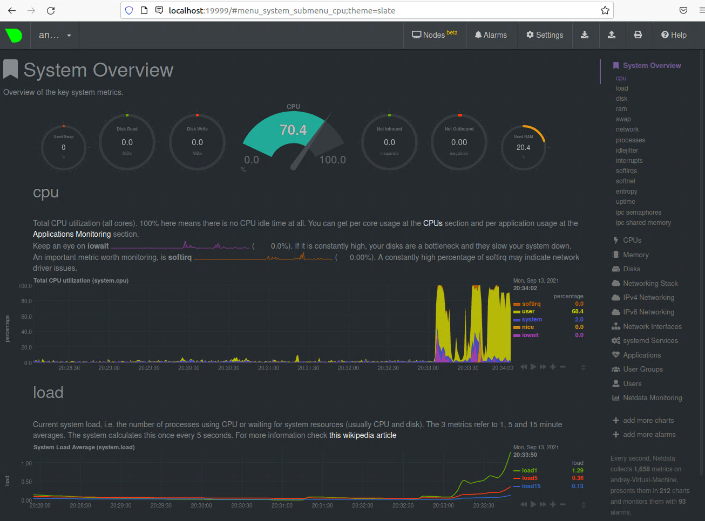

# Домашнее задание к занятию "3.4. Операционные системы, лекция 2"

> 1. На лекции мы познакомились с [node_exporter](https://github.com/prometheus/node_exporter/releases). В демонстрации его исполняемый файл запускался в background. Этого достаточно для демо, но не для настоящей production-системы, где процессы должны находиться под внешним управлением. Используя знания из лекции по systemd, создайте самостоятельно простой [unit-файл](https://www.freedesktop.org/software/systemd/man/systemd.service.html) для node_exporter:
> 
>     * поместите его в автозагрузку,
>     * предусмотрите возможность добавления опций к запускаемому процессу через внешний файл (посмотрите, например, на `systemctl cat cron`),
>     * удостоверьтесь, что с помощью systemctl процесс корректно стартует, завершается, а после перезагрузки автоматически поднимается.

Кладём исполняемый файл сервиса в каталог `/usr/sbin`, создаём пользователя для запуска сервиса:
```bash
ln node_exporter /usr/sbin/
useradd -M -s /sbin/nologin node_exporter
usermod -L node_exporter
```
Создаём файл конфигурации `/etc/sysconfig/node_exporter`:
```
OPTIONS=""
```
Создаём файл сервиса `sudo systemctl edit --force --full node_exporter.service` со следующим содержимым:
```
[Unit]
Description=Node Exporter
StartLimitBurst=10
StartLimitIntervalSec=10

[Service]
Restart=always
User=node_exporter
EnvironmentFile=/etc/sysconfig/node_exporter
ExecStart=/usr/sbin/node_exporter $OPTIONS

[Install]
WantedBy=multi-user.target
```
Проверяем правильность создания сервиса:
```bash
systemctl status node_exporter
```
```
● node_exporter.service - Node Exporter
     Loaded: loaded (/etc/systemd/system/node_exporter.service; disabled; vendor preset: enabled)
     Active: inactive (dead)
```
Разрешаем работу сервиса и запускаем его:
```bash
systemctl enable node_exporter
systemctl start node_exporter
```
```
● node_exporter.service - Node Exporter
     Loaded: loaded (/etc/systemd/system/node_exporter.service; enabled; vendor preset: enabled)
     Active: active (running) since Mon 2021-09-13 20:02:51 MSK; 5s ago
   Main PID: 2863 (node_exporter)
      Tasks: 3 (limit: 2234)
     Memory: 2.0M
     CGroup: /system.slice/node_exporter.service
             └─2863 /usr/sbin/node_exporter
```
Перегружаем виртуальную машину и убеждаемся, что сервис запустился:
```bash
systemctl status node_exporter
```
```
● node_exporter.service - Node Exporter
     Loaded: loaded (/etc/systemd/system/node_exporter.service; enabled; vendor preset: enabled)
     Active: active (running) since Mon 2021-09-13 20:03:59 MSK; 56s ago
   Main PID: 474 (node_exporter)
      Tasks: 4 (limit: 2234)
     Memory: 13.7M
     CGroup: /system.slice/node_exporter.service
             └─474 /usr/sbin/node_exporter

сен 13 20:03:59 andrey-Virtual-Machine node_exporter[474]: level=info ts=2021-09-13T17:03:59.324Z caller=node_exporter.go:115 collector=thermal_z>
сен 13 20:03:59 andrey-Virtual-Machine node_exporter[474]: level=info ts=2021-09-13T17:03:59.324Z caller=node_exporter.go:115 collector=time
сен 13 20:03:59 andrey-Virtual-Machine node_exporter[474]: level=info ts=2021-09-13T17:03:59.324Z caller=node_exporter.go:115 collector=timex
сен 13 20:03:59 andrey-Virtual-Machine node_exporter[474]: level=info ts=2021-09-13T17:03:59.324Z caller=node_exporter.go:115 collector=udp_queues
сен 13 20:03:59 andrey-Virtual-Machine node_exporter[474]: level=info ts=2021-09-13T17:03:59.324Z caller=node_exporter.go:115 collector=uname
сен 13 20:03:59 andrey-Virtual-Machine node_exporter[474]: level=info ts=2021-09-13T17:03:59.324Z caller=node_exporter.go:115 collector=vmstat
сен 13 20:03:59 andrey-Virtual-Machine node_exporter[474]: level=info ts=2021-09-13T17:03:59.324Z caller=node_exporter.go:115 collector=xfs
сен 13 20:03:59 andrey-Virtual-Machine node_exporter[474]: level=info ts=2021-09-13T17:03:59.324Z caller=node_exporter.go:115 collector=zfs
сен 13 20:03:59 andrey-Virtual-Machine node_exporter[474]: level=info ts=2021-09-13T17:03:59.324Z caller=node_exporter.go:199 msg="Listening on" >
сен 13 20:03:59 andrey-Virtual-Machine node_exporter[474]: level=info ts=2021-09-13T17:03:59.324Z caller=tls_config.go:191 msg="TLS is disabled.">
```

> 2. Ознакомьтесь с опциями node_exporter и выводом `/metrics` по-умолчанию. Приведите несколько опций, которые вы бы выбрали для базового мониторинга хоста по CPU, памяти, диску и сети.

Вывод `node_exporter` смотрим командой:
```bash
curl http://localhost:9100/metrics
```
Для мониторинга загрузки CPU можно использовать метрики:
- loadavg
- cpu
- stat
- vmstat
Для мониторинга памяти:
- meminfo
- vmstat
Для мониторинга диска:
- diskstats
- filesystem
- mdadm
- xfs
- vmstat
Для мониторинга сети:
- netstat
- netdev

> 3. Установите в свою виртуальную машину [Netdata](https://github.com/netdata/netdata). Воспользуйтесь [готовыми пакетами](https://packagecloud.io/netdata/netdata/install) для установки (`sudo apt install -y netdata`). После успешной установки:
>     * в конфигурационном файле `/etc/netdata/netdata.conf` в секции [web] замените значение с localhost на `bind to = 0.0.0.0`,
>     * добавьте в Vagrantfile проброс порта Netdata на свой локальный компьютер и сделайте `vagrant reload`:
> 
>     ```bash
>     config.vm.network "forwarded_port", guest: 19999, host: 19999
>     ```
> 
>     После успешной перезагрузки в браузере *на своем ПК* (не в виртуальной машине) вы должны суметь зайти на `localhost:19999`. Ознакомьтесь с метриками, которые по умолчанию собираются Netdata и с комментариями, которые даны к этим метрикам.



> 4. Можно ли по выводу `dmesg` понять, осознает ли ОС, что загружена не на настоящем оборудовании, а на системе виртуализации?

В системном логе выводятся характеристики компьютера, на котором запущена ОС, полученные при помощи DMI:
```bash
dmesg | grep -i DMI
```
```
[    0.000000] DMI: Microsoft Corporation Virtual Machine/Virtual Machine, BIOS Hyper-V UEFI Release v4.0 11/01/2019
[    0.033480] ACPI: Added _OSI(Linux-Lenovo-NV-HDMI-Audio)
```
Также можно искать вхождение `virtual`:
```bash
dmesg | grep -i virtual
```
```
[    0.000000] DMI: Microsoft Corporation Virtual Machine/Virtual Machine, BIOS Hyper-V UEFI Release v4.0 11/01/2019
[    0.008252] Booting paravirtualized kernel on Hyper-V
[    0.349905] hid 0006:045E:0621.0001: input: VIRTUAL HID v0.01 Mouse [Microsoft Vmbus HID-compliant Mouse] on 
[    0.364241] scsi 0:0:0:0: Direct-Access     Msft     Virtual Disk     1.0  PQ: 0 ANSI: 5
[    0.364890] scsi 0:0:0:1: CD-ROM            Msft     Virtual DVD-ROM  1.0  PQ: 0 ANSI: 0
[    0.649857] systemd[1]: Detected virtualization microsoft.
[    0.650520] systemd[1]: Set hostname to <andrey-Virtual-Machine>.
[    0.845076] systemd[1]: Unnecessary job for /sys/devices/virtual/misc/vmbus!hv_fcopy was removed.
[    0.845082] systemd[1]: Unnecessary job for /sys/devices/virtual/misc/vmbus!hv_vss was removed.
```

Если же ОС запущена на реальном железе, вывод будет отличаться. К сожалению, сейчас у меня нет доступа к ОС, запущенной на реальном железе, но, например, [тут](https://serverfault.com/questions/65718/vmware-linux-server-how-can-you-tell-if-you-are-a-vm-or-real-hardware) приводится следующий вывод:
```
DMI 2.5 present.
DMI: IBM System x3650 M3 -[7945AC1]-/90Y4784, BIOS -[D6E153AUS-1.12]- 06/30/2011
```

> 5. Как настроен sysctl `fs.nr_open` на системе по-умолчанию? Узнайте, что означает этот параметр. Какой другой существующий лимит не позволит достичь такого числа (`ulimit --help`)?

```bash
sysctl fs.nr_open
```
```
1048576
```
Данный параметр ограничивает количество файлов (всех видов), которые может открыть один процесс. Данное ограничение работает на уровне ядра системы. Максимально возможное значение определяется ядром, и обычно на платформе x86_64 равно 2147483584.

Изменить ограничение `fs.nr_open` можно командой:
```bash
sysctl -w fs.nr_open=2147483584
```
Либо добавить новое значение параметра в файл `/etc/sysctl.conf`, чтобы изменения применялись сразу при загрузке ОС.

Существует также ограничение максимального количества открываемых одним процессом файлов в пределах пользовательской сессии:
```bash
ulimit -n
```
```
1024
```
Это ограничение можно менять стандартными для PAM методами: в файлах конфигурации `/etc/limits.conf` и пр. или при помощи `ulimit`:
```bash
ulimit -S -n 512
```

> 6. Запустите любой долгоживущий процесс (не `ls`, который отработает мгновенно, а, например, `sleep 1h`) в отдельном неймспейсе процессов; покажите, что ваш процесс работает под PID 1 через `nsenter`. Для простоты работайте в данном задании под root (`sudo -i`). Под обычным пользователем требуются дополнительные опции (`--map-root-user`) и т.д.

Запускаем процесс `sleep 1h` в отдельном `PID namespace`:
```bash
unshare -f --pid --mount-proc sleep 1h
```

В другой сессии смотрим список процессов, связанный со `sleep 1h`:
```bash
ps -eaf --forest | grep "[s]leep"
```
```
root        7424    7423  0 13:13 pts/0    00:00:00  |   |   \_ unshare -f --pid --mount-proc sleep 1h
root        7425    7424  0 13:13 pts/0    00:00:00  |   |       \_ sleep 1h
```

Входим в `PID namespace` данного процесса:
```bash
nsenter -t 7425 --pid --mount
```
и смотрим его список процессов:
```bash
ps -eaf --forest
```
```
UID          PID    PPID  C STIME TTY          TIME CMD
root          13       0  0 13:19 pts/1    00:00:00 -bash
root          22      13  0 13:19 pts/1    00:00:00  \_ ps -eaf --forest
root           1       0  0 13:13 pts/0    00:00:00 sleep 1h
```

> 7. Найдите информацию о том, что такое `:(){ :|:& };:`. Запустите эту команду в своей виртуальной машине Vagrant с Ubuntu 20.04 (**это важно, поведение в других ОС не проверялось**). Некоторое время все будет "плохо", после чего (минуты) – ОС должна стабилизироваться. Вызов `dmesg` расскажет, какой механизм помог автоматической стабилизации. Как настроен этот механизм по-умолчанию, и как изменить число процессов, которое можно создать в сессии?

Данная команда определяет функцию с именем `:` (`:(){ ... }`), тело которой рекурсивно запускает одновременно две копии себя самой `:|:` (одновременно, потому что нужно обеспечить передачу данных от одной копии к другой через pipe `|`). Тело функции выполняется в фоновом режиме (`&`), это не позволяет остановить выполнение всего дерева процессов остановкой первого родительского процесса. Чтобы избавиться от этого скрипта, необходимо будет остановить ВСЕ такие процессы. Маловероятно, что это вообще возможно, поскольку поиск и закрытие процессов будет скорее всего более длительной операцией, чем создание новых.

С другой стороны, запуск тела функции в фоне замедляет рост количества процессов, потому что родительский процесс после создания двух новых сразу завершается, не дожидаясь окончания их выполнения. Если запустить скрипт, заменив в нём `&` на `;`, то количество процессов будет расти быстрее, но теперь, как только будет достигнут системный лимит на количество пользовательских процессов (см. ниже), самый первый родительский процесс будет остановлен, и автоматически также прекратят работу все порождённые им процессы. Скрипт потеряет свою "вирусную" особенность.  

Для предотвращения такой ситуации в Linux существует ограничение на количество процессов, которое может запустить пользовательская сессия. Это ограничение на моей системе:
```bash
ulimit -u
```
```
7499
```


Запуск скрипта в изначальном варианте с `&` при достижении предела мешает нормальной работе системы, потому что она постоянно не может запустить новые процессы, и сообщает об этом в поток stderr:
```
bash: fork: Resource temporarily unavailable
```
или
```
bash: fork: retry: Resource temporarily unavailable
```

Вариант с `;` более щадящий, потому что довольно быстро система останавливает самый первый родительский процесс:
```
Terminated
```
и ОС приходит в стабильное состояние.

Я проводил тесты предварительно существенно ограничив число пользовательских процессов:
```
ulimit -S -u 100
```
Реакция ОС на скрипт благодаря этому появлялась быстрее.