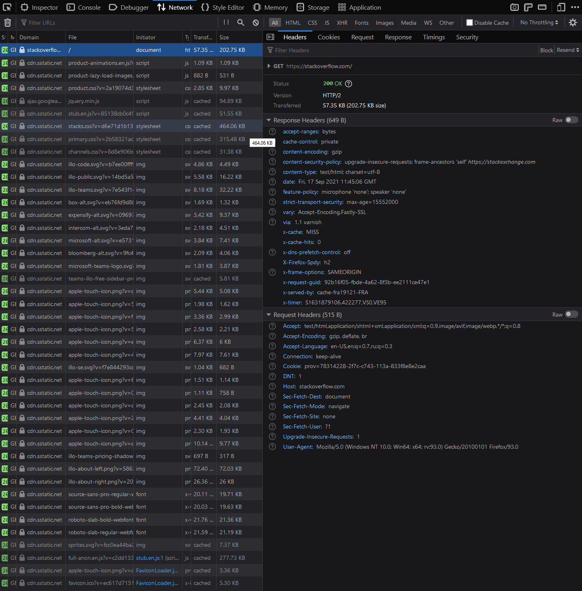
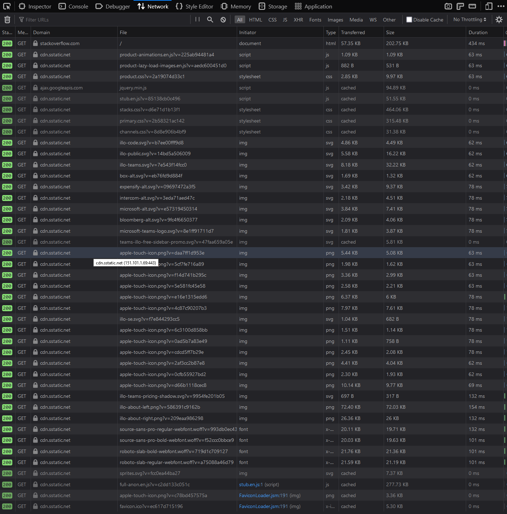

# Домашнее задание к занятию "3.6. Компьютерные сети, лекция 1"

>1. Работа c HTTP через телнет.
>- Подключитесь утилитой телнет к сайту stackoverflow.com
>`telnet stackoverflow.com 80`
>- отправьте HTTP запрос
>```bash
>GET /questions HTTP/1.0
>HOST: stackoverflow.com
>[press enter]
>[press enter]
>```
>- В ответе укажите полученный HTTP код, что он означает?

```shell
$ telnet stackoverflow.com 80
Trying 151.101.193.69...
Connected to stackoverflow.com.
Escape character is '^]'.
GET /questions HTTP/1.0
Host: stackoverflow.com

HTTP/1.1 301 Moved Permanently
cache-control: no-cache, no-store, must-revalidate
location: https://stackoverflow.com/questions
x-request-guid: f4370604-2c4e-48e0-9687-2cf9a31aef49
feature-policy: microphone 'none'; speaker 'none'
content-security-policy: upgrade-insecure-requests; frame-ancestors 'self' https://stackexchange.com
Accept-Ranges: bytes
Date: Fri, 17 Sep 2021 11:39:42 GMT
Via: 1.1 varnish
Connection: close
X-Served-By: cache-fra19178-FRA
X-Cache: MISS
X-Cache-Hits: 0
X-Timer: S1631878782.066591,VS0,VE92
Vary: Fastly-SSL
X-DNS-Prefetch-Control: off
Set-Cookie: prov=445a421b-dbe1-3781-007a-91e2332a32ba; domain=.stackoverflow.com; expires=Fri, 01-Jan-2055 00:00:00 GMT; path=/; HttpOnly

Connection closed by foreign host.
```

Код возврата 301 (`HTTP/1.1 301 Moved Permanently`).

Он означает, что содержимое по данному адресу более не доступно (на постоянной основе, данный результат не изменится при повторных попытках), и предлагает обратиться взамен к содержимому по адресу `location: https://stackoverflow.com/questions`.

Поскольку в предлагаемом адресе поменялся только протокол, технически это означает, что сайт не принимает нешифрованное соединение по протоколу HTTP, и предлагает использовать протокол HTTPS. 

> 2. Повторите задание 1 в браузере, используя консоль разработчика F12.
> - откройте вкладку `Network`
> - отправьте запрос http://stackoverflow.com
> - найдите первый ответ HTTP сервера, откройте вкладку `Headers`
> - укажите в ответе полученный HTTP код.
> - проверьте время загрузки страницы, какой запрос обрабатывался дольше всего?
> - приложите скриншот консоли браузера в ответ.



Код ответа: 200. В отличие от предыдущего случая, браузер самостоятельно сменил протокол с HTTP на HTTPS, поэтому запрос прошёл успешно с первого раза.




Дольше всего загружались изображения для оформления фона страницы.

> 3. Какой IP адрес у вас в интернете?

```shell
$ curl ifconfig.me
178.155.4.211
```

> 4. Какому провайдеру принадлежит ваш IP адрес? Какой автономной системе AS? Воспользуйтесь утилитой `whois`

```shell
$ whois -h whois.ripe.net 178.155.4.211
% This is the RIPE Database query service.
% The objects are in RPSL format.
%
% The RIPE Database is subject to Terms and Conditions.
% See http://www.ripe.net/db/support/db-terms-conditions.pdf

% Note: this output has been filtered.
%       To receive output for a database update, use the "-B" flag.

% Information related to '178.155.0.0 - 178.155.63.255'

% Abuse contact for '178.155.0.0 - 178.155.63.255' is 'abuse@mtu.ru'

inetnum:        178.155.0.0 - 178.155.63.255
netname:        MTS-BROADBAND
descr:          MTS PJSC
country:        RU
admin-c:        MT12425-RIPE
admin-c:        MTS134-RIPE
tech-c:         MT12425-RIPE
tech-c:         MTS134-RIPE
status:         ASSIGNED PA
mnt-by:         KUBANGSM-MNT
created:        2012-03-27T07:58:25Z
last-modified:  2015-12-10T13:25:09Z
source:         RIPE # Filtered

person:         Mobile TeleSystem
remarks:        OJSC Mobile TeleSystems Branch Macro-region South
address:        61, Gimnazicheskaya str., Krasnodar, Russia, 350000
phone:          +78612460116
fax-no:         +78612671535
nic-hdl:        MT12425-RIPE
mnt-by:         KUBANGSM-MNT
created:        2012-12-12T07:54:10Z
last-modified:  2012-12-12T11:38:14Z
source:         RIPE # Filtered

person:         Mobile TeleSystems
remarks:        OJSC Mobile TeleSystems Branch Macro-region South
address:        61, Gimnazicheskaya str., Krasnodar, Russia, 350000
phone:          +78612460116
fax-no:         +78612671535
nic-hdl:        MTS134-RIPE
mnt-by:         KUBANGSM-MNT
created:        2015-02-16T07:21:31Z
last-modified:  2017-10-30T22:44:15Z
source:         RIPE # Filtered

% Information related to '178.155.4.0/24AS29497'

route:          178.155.4.0/24
origin:         AS29497
mnt-by:         KUBANGSM-MNT
mnt-by:         MTU-NOC
created:        2017-06-28T00:17:57Z
last-modified:  2017-06-28T00:17:57Z
source:         RIPE

% This query was served by the RIPE Database Query Service version 1.101 (HEREFORD)
```

> Провайдер: __Mobile TeleSystems, OJSC Mobile TeleSystems Branch Macro-region South__  
> Автономная система: __AS29497__

> 5. Через какие сети проходит пакет, отправленный с вашего компьютера на адрес 8.8.8.8? Через какие AS? Воспользуйтесь утилитой `traceroute`

```shell
$ traceroute -A 8.8.8.8
traceroute to 8.8.8.8 (8.8.8.8), 30 hops max, 60 byte packets
 1  172.29.224.1 (172.29.224.1) [*]  0.229 ms  0.214 ms  0.209 ms
 2  192.168.0.1 (192.168.0.1) [*]  1.011 ms  0.714 ms  1.157 ms
 3  10.255.61.251 (10.255.61.251) [*]  4.388 ms  4.272 ms  4.382 ms
 4  10.255.61.18 (10.255.61.18) [*]  2.615 ms  2.929 ms  3.119 ms
 5  10.255.61.14 (10.255.61.14) [*]  2.754 ms  2.990 ms  2.432 ms
 6  10.250.245.250 (10.250.245.250) [*]  3.951 ms 10.250.245.254 (10.250.245.254) [*]  10.676 ms 10.250.245.250 (10.250.245.250) [*]  10.652 ms
 7  10.249.12.29 (10.249.12.29) [*]  10.591 ms 10.249.13.30 (10.249.13.30) [*]  6.032 ms  5.997 ms
 8  195.34.36.115 (195.34.36.115) [AS8359]  4.188 ms 10.249.12.59 (10.249.12.59) [*]  4.638 ms  4.621 ms
 9  kai-cr01-ae23.200.rnd.mts-internet.net (195.34.36.114) [AS8359]  4.176 ms 10.249.13.37 (10.249.13.37) [*]  4.349 ms  4.332 ms
10  195.34.36.115 (195.34.36.115) [AS8359]  4.556 ms  4.541 ms  4.057 ms
11  kai-cr01-ae23.200.rnd.mts-internet.net (195.34.36.114) [AS8359]  4.080 ms 195.34.36.115 (195.34.36.115) [AS8359]  4.493 ms kai-cr01-ae23.200.rnd.mts-internet.net (195.34.36.114) [AS8359]  2.804 ms
12  kai-cr02-ae4.61.rnd.mts-internet.net (195.34.53.198) [AS8359]  22.150 ms mag9-cr02-be14.77.msk.mts-internet.net (195.34.53.113) [AS8359]  22.145 ms kai-cr02-ae4.61.rnd.mts-internet.net (195.34.53.198) [AS8359]  22.033 ms
13  mag9-cr01-be16.77.msk.mts-internet.net (212.188.29.82) [AS8359]  22.121 ms * a433-cr02-be3.61.msk.mts-internet.net (212.188.28.133) [AS8359]  22.540 ms
14  mag9-cr02-be14.77.msk.mts-internet.net (195.34.53.113) [AS8359]  22.716 ms  21.974 ms  21.969 ms
15  209.85.249.158 (209.85.249.158) [AS15169]  40.114 ms 172.253.66.116 (172.253.66.116) [AS15169]  40.783 ms mag9-cr01-be16.77.msk.mts-internet.net (212.188.29.82) [AS8359]  22.078 ms
16  108.170.250.83 (108.170.250.83) [AS15169]  23.430 ms 108.170.250.66 (108.170.250.66) [AS15169]  23.112 ms 108.170.250.83 (108.170.250.83) [AS15169]  23.089 ms
17  216.239.51.32 (216.239.51.32) [AS15169]  39.886 ms * *
18  172.253.66.108 (172.253.66.108) [AS15169]  37.560 ms 216.239.57.222 (216.239.57.222) [AS15169]  41.104 ms 209.85.254.20 (209.85.254.20) [AS15169]  40.642 ms
19  172.253.51.241 (172.253.51.241) [AS15169]  40.440 ms 142.250.56.15 (142.250.56.15) [AS15169]  39.511 ms *
20  * * *
21  * * *
22  * * *
23  * * *
24  * * *
25  * * *
26  * * *
27  * * *
28  dns.google (8.8.8.8) [AS15169]  40.228 ms * *
```

- хоп 1 - выход из WSL2 в хост-машину;
- хоп 2 - из хост машины на роутер;
- хопы 3-7 - "местное" сетевое оборудование провайдера (вероятно, физически расположенное локальное в месте моего нахождения);
- хопы 8-14 - оборудование провайдера, автономная система AS8359 (МТС, Москва);
- хоп 15 - маршрут пошёл двумя разными путями, один через ещё один сервер провайдера автономная система AS8359 (МТС, Москва), два остальных - непосредственно в автономную систему AS15169 (Google, USA) 
- хопы 15-19 - автономная система AS15169 (Google, USA);
- хопы 20-27 - нераскрываемые узлы маршрутизации, вероятнее всего тоже в автономная система AS15169 (Google, USA);
- хоп 28 - конечный узел.

Маршрут почти достиг дефолтного предела в 30 хопов.

> 6. Повторите задание 5 в утилите `mtr`. На каком участке наибольшая задержка - delay?

```shell
$ mtr -z 8.8.8.8
                                      My traceroute  [v0.93]
WORK (172.29.235.171)                                                    2021-09-17T14:31:33+0300
Keys:  Help   Display mode   Restart statistics   Order of fields   quit
                                                         Packets               Pings
 Host                                                  Loss%   Snt   Last   Avg  Best  Wrst StDev
 1. AS???    172.29.224.1                               0.0%    33    0.4   0.3   0.1   0.7   0.2
 2. AS???    192.168.0.1                                0.0%    33    1.1   1.2   0.5   7.2   1.2
 3. AS???    10.255.61.251                              0.0%    33    3.5   4.3   2.8  10.0   1.8
 4. AS???    10.255.61.18                               0.0%    33    2.8   3.8   2.2  15.1   3.0
 5. AS???    10.255.61.14                               0.0%    33    2.7   3.4   2.2  12.1   2.4
 6. AS???    10.250.245.250                             0.0%    33    3.9   4.8   3.3  13.0   2.5
 7. AS???    10.249.13.34                               0.0%    33    6.5   5.9   2.9  18.4   3.4
 8. AS???    10.249.12.59                               0.0%    33    4.9   6.8   3.2  25.6   5.2
 9. AS???    10.249.13.39                               0.0%    33    3.8   4.7   3.2  11.3   1.9
10. AS???    195.34.36.115                              0.0%    33    3.7   4.0   2.9  11.7   1.8
11. AS???    195.34.36.114                              0.0%    33    3.4   4.0   2.8  11.6   2.0
12. AS???    195.34.53.198                              0.0%    33   27.2  24.1  21.8  29.5   2.2
13. AS???    212.188.28.133                             0.0%    33   21.6  23.1  21.6  31.1   2.5
14. AS???    195.34.53.113                              0.0%    33   22.0  22.8  21.9  29.7   1.7
15. AS???    212.188.29.82                              0.0%    33   26.7  22.8  21.5  29.1   1.9
16. AS???    108.170.250.66                             0.0%    33   23.6  24.1  22.9  32.1   2.3
17. AS???    209.85.255.136                            24.2%    33   40.3  41.7  40.1  51.3   2.7
18. AS???    209.85.254.20                              0.0%    33   40.4  41.3  40.1  49.2   2.0
19. AS???    142.250.210.103                            0.0%    33   41.6  43.0  41.2  49.6   2.5
20. (waiting for reply)
21. (waiting for reply)
22. (waiting for reply)
23. (waiting for reply)
24. (waiting for reply)
25. (waiting for reply)
26. (waiting for reply)
27. (waiting for reply)
28. (waiting for reply)
29. AS???    8.8.8.8                                    0.0%    32   41.6  40.3  39.3  47.1   1.7
```

Видим, что основая задержка появляется внутри сети провайдера МТС при переходе с маршрутизатора 195.34.36.114 на 195.34.53.198, и затем внутри провайдера Google при переходе с 108.170.250.66 на 209.85.255.136, причем на последнем переходе наблюдается ещё и значительная потеря пакетов.

> 7. Какие DNS сервера отвечают за доменное имя dns.google? Какие A записи? воспользуйтесь утилитой `dig`

```shell
$ dig dns.google NS

; <<>> DiG 9.16.1-Ubuntu <<>> dns.google NS
;; global options: +cmd
;; Got answer:
;; ->>HEADER<<- opcode: QUERY, status: NOERROR, id: 24253
;; flags: qr rd ad; QUERY: 1, ANSWER: 4, AUTHORITY: 0, ADDITIONAL: 0
;; WARNING: recursion requested but not available

;; QUESTION SECTION:
;dns.google.                    IN      NS

;; ANSWER SECTION:
dns.google.             0       IN      NS      ns4.zdns.google.
dns.google.             0       IN      NS      ns2.zdns.google.
dns.google.             0       IN      NS      ns3.zdns.google.
dns.google.             0       IN      NS      ns1.zdns.google.

;; Query time: 40 msec
;; SERVER: 172.29.224.1#53(172.29.224.1)
;; WHEN: Fri Sep 17 15:03:52 MSK 2021
;; MSG SIZE  rcvd: 154
```
```shell
$ dig dns.google A

; <<>> DiG 9.16.1-Ubuntu <<>> dns.google A
;; global options: +cmd
;; Got answer:
;; ->>HEADER<<- opcode: QUERY, status: NOERROR, id: 29582
;; flags: qr rd ad; QUERY: 1, ANSWER: 2, AUTHORITY: 0, ADDITIONAL: 0
;; WARNING: recursion requested but not available

;; QUESTION SECTION:
;dns.google.                    IN      A

;; ANSWER SECTION:
dns.google.             0       IN      A       8.8.4.4
dns.google.             0       IN      A       8.8.8.8

;; Query time: 50 msec
;; SERVER: 172.29.224.1#53(172.29.224.1)
;; WHEN: Fri Sep 17 15:16:45 MSK 2021
;; MSG SIZE  rcvd: 70
```

> 8. Проверьте PTR записи для IP адресов из задания 7. Какое доменное имя привязано к IP? воспользуйтесь утилитой `dig`

```shell
$ dig -x 8.8.8.8

; <<>> DiG 9.16.1-Ubuntu <<>> -x 8.8.8.8
;; global options: +cmd
;; Got answer:
;; ->>HEADER<<- opcode: QUERY, status: NOERROR, id: 48401
;; flags: qr rd ad; QUERY: 1, ANSWER: 1, AUTHORITY: 0, ADDITIONAL: 0
;; WARNING: recursion requested but not available

;; QUESTION SECTION:
;8.8.8.8.in-addr.arpa.          IN      PTR

;; ANSWER SECTION:
8.8.8.8.in-addr.arpa.   0       IN      PTR     dns.google.

;; Query time: 0 msec
;; SERVER: 172.29.224.1#53(172.29.224.1)
;; WHEN: Fri Sep 17 15:34:48 MSK 2021
;; MSG SIZE  rcvd: 82
```
```shell
$ dig -x 8.8.4.4

; <<>> DiG 9.16.1-Ubuntu <<>> -x 8.8.4.4
;; global options: +cmd
;; Got answer:
;; ->>HEADER<<- opcode: QUERY, status: NOERROR, id: 19446
;; flags: qr rd ad; QUERY: 1, ANSWER: 1, AUTHORITY: 0, ADDITIONAL: 0
;; WARNING: recursion requested but not available

;; QUESTION SECTION:
;4.4.8.8.in-addr.arpa.          IN      PTR

;; ANSWER SECTION:
4.4.8.8.in-addr.arpa.   0       IN      PTR     dns.google.

;; Query time: 50 msec
;; SERVER: 172.29.224.1#53(172.29.224.1)
;; WHEN: Fri Sep 17 15:35:36 MSK 2021
;; MSG SIZE  rcvd: 82
```

