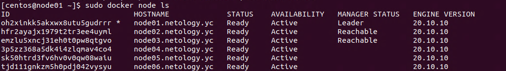
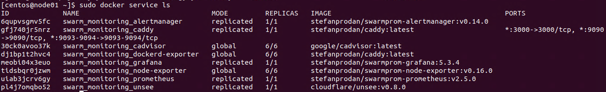

# Домашнее задание к занятию "5.5. Оркестрация кластером Docker контейнеров на примере Docker Swarm"

## Задача 1

> Дайте письменые ответы на следующие вопросы:
> 
> - В чём отличие режимов работы сервисов в Docker Swarm кластере: replication и global?
> - Какой алгоритм выбора лидера используется в Docker Swarm кластере?
> - Что такое Overlay Network?

- В чём отличие режимов работы сервисов в Docker Swarm кластере: replication и global?

  В режиме replication для сервиса указывается необходимое количество реплик, и кластер размещает сервисы по доступным узлам на своё усмотрение. В частности, при добавлении в кластер нового узла сервис на нём может и не запускаться, если текущего количества реплик достаточно.

  В режиме global сервис гарантировано запускается на каждом узле, в том числе при добавлении нового узла в кластер, при этом на каждом узле запускается точно одна копия. Подразумевается, что данный режим нужен в первую очередь для систем мониторинга и им подобным.
  

- Какой алгоритм выбора лидера используется в Docker Swarm кластере?
  
  Для выбора лидера в кластере используется алгоритм Raft, согласно которому лидером объявляется узел, собравший более половины "голосов" всех узлов, входящих в кластер. Это гарантирует, что не может возникнуть ситуация "два лидера на кластер", хотя в случае "распада" кластера на несколько частей это может привести к невозможности выбора лидера. 
  

- Что такое Overlay Network?
  
  Оверлейной называется логическая сеть, которая создаётся поверх другой сети, например, для создания шифрованной закрытой сети между несколькими узлами, являющимися общедоступными в исходной сети. Самым известным примером оверлейных сетей является технология VPN.

## Задача 2

> Создать ваш первый Docker Swarm кластер в Яндекс.Облаке
> 
> Для получения зачета, вам необходимо предоставить скриншот из терминала (консоли), с выводом команды:
> ```
> docker node ls
> ```

```bash
Apply complete! Resources: 13 added, 0 changed, 0 destroyed.

Outputs:

external_ip_address_node01 = "51.250.6.40"
external_ip_address_node02 = "51.250.11.22"
external_ip_address_node03 = "51.250.7.135"
external_ip_address_node04 = "51.250.11.65"
external_ip_address_node05 = "51.250.2.203"
external_ip_address_node06 = "51.250.10.173"
internal_ip_address_node01 = "192.168.101.11"
internal_ip_address_node02 = "192.168.101.12"
internal_ip_address_node03 = "192.168.101.13"
internal_ip_address_node04 = "192.168.101.14"
internal_ip_address_node05 = "192.168.101.15"
internal_ip_address_node06 = "192.168.101.16"
andrey@andrey-VM:~/work/netology/05-05/src/terraform$ ssh centos@51.250.6.40
```
```bash
[centos@node01 ~]$ sudo docker node ls
ID                            HOSTNAME             STATUS    AVAILABILITY   MANAGER STATUS   ENGINE VERSION
oh2xinkk5akxwx8utu5gudrrr *   node01.netology.yc   Ready     Active         Leader           20.10.10
hfr2ayajx1979t2tr3ee4uyml     node02.netology.yc   Ready     Active         Reachable        20.10.10
emzlu5xncj31eh0t0pw8qtgvo     node03.netology.yc   Ready     Active         Reachable        20.10.10
3p5zz368a5dk4i4zlqmav4co4     node04.netology.yc   Ready     Active                          20.10.10
sk50htrd3fv6hv0v0qw08waiu     node05.netology.yc   Ready     Active                          20.10.10
tjd111gnkzm5h0pdj042vysyu     node06.netology.yc   Ready     Active                          20.10.10
```



## Задача 3

> Создать ваш первый, готовый к боевой эксплуатации кластер мониторинга, состоящий из стека микросервисов.
> 
> Для получения зачета, вам необходимо предоставить скриншот из терминала (консоли), с выводом команды:
> ```
> docker service ls
> ```

```bash
[centos@node01 ~]$ sudo docker service ls
ID             NAME                                MODE         REPLICAS   IMAGE                                          PORTS
6qupvsgmv5fc   swarm_monitoring_alertmanager       replicated   1/1        stefanprodan/swarmprom-alertmanager:v0.14.0    
gfj740jr5nrz   swarm_monitoring_caddy              replicated   1/1        stefanprodan/caddy:latest                      *:3000->3000/tcp, *:9090->9090/tcp, *:9093-9094->9093-9094/tcp
30ck0avoo37k   swarm_monitoring_cadvisor           global       6/6        google/cadvisor:latest                         
dj1bp1t2hvc4   swarm_monitoring_dockerd-exporter   global       6/6        stefanprodan/caddy:latest                      
meobi04x3euo   swarm_monitoring_grafana            replicated   1/1        stefanprodan/swarmprom-grafana:5.3.4           
tidsbqr0jzwm   swarm_monitoring_node-exporter      global       6/6        stefanprodan/swarmprom-node-exporter:v0.16.0   
uiab3jcrv6gy   swarm_monitoring_prometheus         replicated   1/1        stefanprodan/swarmprom-prometheus:v2.5.0       
pl4j7omqbo52   swarm_monitoring_unsee              replicated   1/1        cloudflare/unsee:v0.8.0                        
[centos@node01 ~]$ 
```



## Задача 4 (*)

> Выполнить на лидере Docker Swarm кластера команду (указанную ниже) и дать письменное описание её функционала, что она делает и зачем она нужна:
> ```
> # см.документацию: https://docs.docker.com/engine/swarm/swarm_manager_locking/
> docker swarm update --autolock=true
> ```

В целях безопасности, кластер Docker Swarm шифрует все логи протокола Raft, используя для этого ключи, общие для всего кластера. В обычном режиме эти ключи записываются в открытом виде на диск. Несмотря на то, что такое открытое хранение ключей представляет определённую угрозу безопасности, это необходимо, чтобы в случае рестарта сервиса docker на одном хосте он смог в автоматическом режиме снова подключиться к кластеру.

Если же необходимо обеспечить ещё большую безопасность, можно установить для кластера режим auto-lock, в котором шифруются уже сами ключи шифрования. Ключ для расшифровки ключей сообщается администратору и хранится только у него. Если сервис docker на хосте будет перезапущен, его использование будет автоматически запрещено (auto-lock) до ручного выполнения операции разблокировки unlock, с указанием полученного ранее ключа.

```bash
[centos@node01 ~]$ sudo docker swarm update --autolock=true
Swarm updated.
To unlock a swarm manager after it restarts, run the `docker swarm unlock`
command and provide the following key:

    SWMKEY-1-P0rggQTOq7Ip6oHxr3iOtZhXhnzJiDtVEyD1xkdjeLk

Please remember to store this key in a password manager, since without it you
will not be able to restart the manager.
```