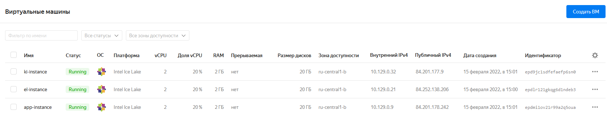
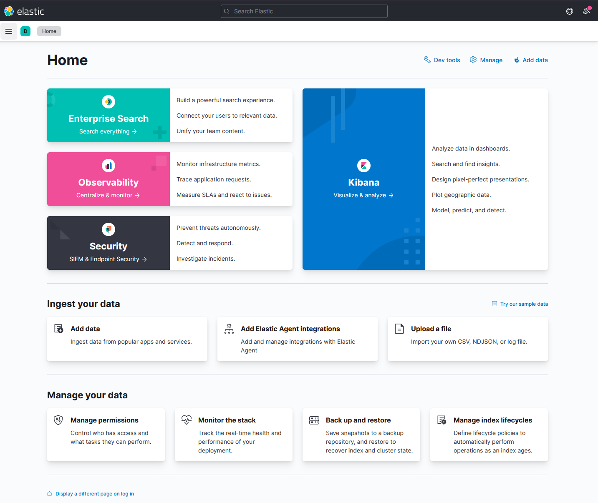
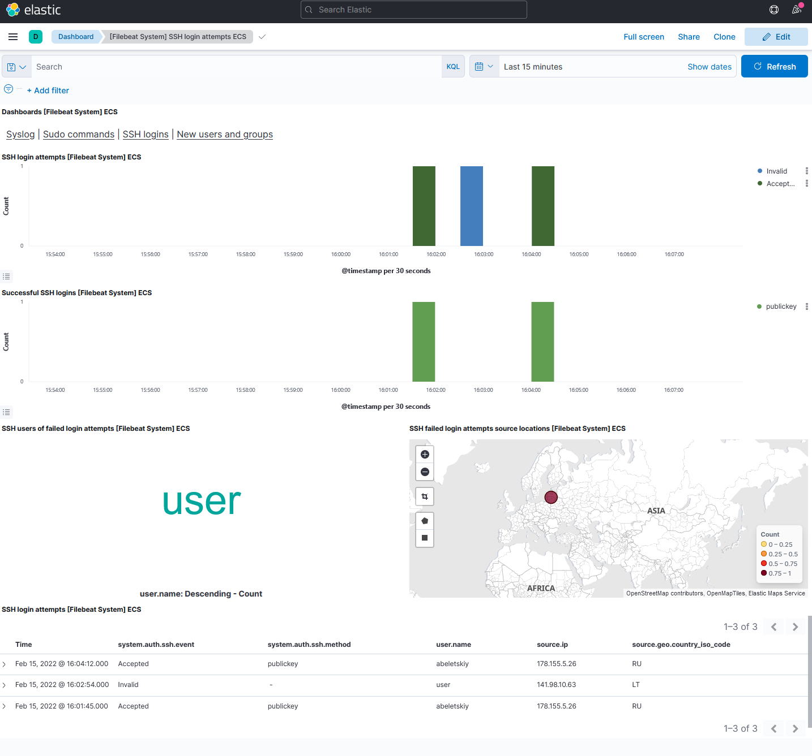

# README #

This playbook is designed to install and configure ElasticSearch and Kibana standalone nodes and add a Filebeat instance on an application node.

Any suggestions for improvements to this e-mail to [abeletskiy@ppr.ru](mailto:abeletskiy@ppr.ru).

## Prerequisites

The playbook is designed to run on RedHat-like Linux operating systems that support RPM packages installation.

### Tested on:
- Centos 7

## Usage

### Specifying Nodes

Specify nodes for ElasticSearch, Kibana, and your application in the inventory file [inventory/prod/hosts.yml](inventory/prod/hosts.yml). You may change credentials as necessary.

For example, you can create them as virtual machines on Yandex.Cloud as shown on the following image:



### ELK stack versions

By default, the playbook installs and configures all ELK components to be of the same version. This version can be specified in [inventory/prod/group_vars/all.yml](inventory/prod/group_vars/all.yml) in `elk_stack_version` variable.

If you prefer to use different versions, change them accordingly in components' group_vars files, e.g. in [inventory/prod/group_vars/kibana.yml](inventory/prod/group_vars/kibana.yml) for Kibana.

### Tuning ELK configuration

If necessary, you can fine-tune configurations of the ElasticSearch, Kibana, or Filebeat using templates files in the [templates](templates) directory.

### Running the playbook

Run playbook against the inventory as usual:

```bash
ansible-playbook site.yml -i inventory/prod
```

### Checking the results

After running the playbook successfully, you may open Kibana's web page using its host IP address and default port 5601. 





## Notes:

ElasticSearch, Kibana, and Filebeat will be installed using RPM into default directories.

To keep idempotency, the playbook leaves ElasticSearch, Kibana, and Filebeat downloaded binary distributions in the temporary directory `/tmp`. If you don't need them, feel free to remove those files to free some disk space.
