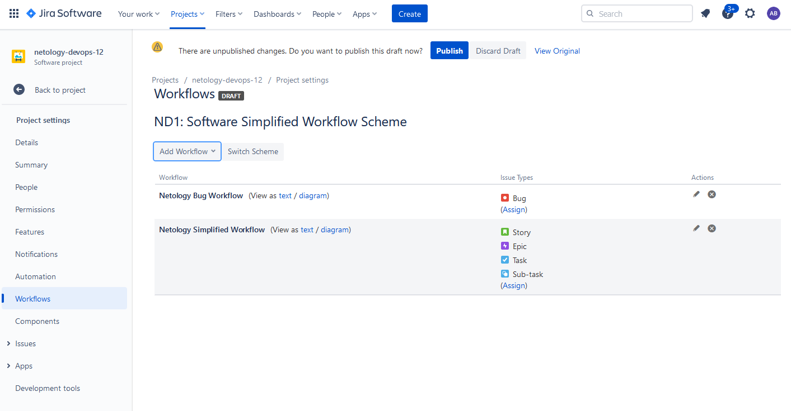

# Домашнее задание к занятию "09.01 Жизненный цикл ПО"

- [Жизненный цикл задач типа Bug](Netology%20Bug%20Workflow.xml)
- [Жизненный цикл задач остального типа](Netology%20Simplified%20Workflow.xml)

