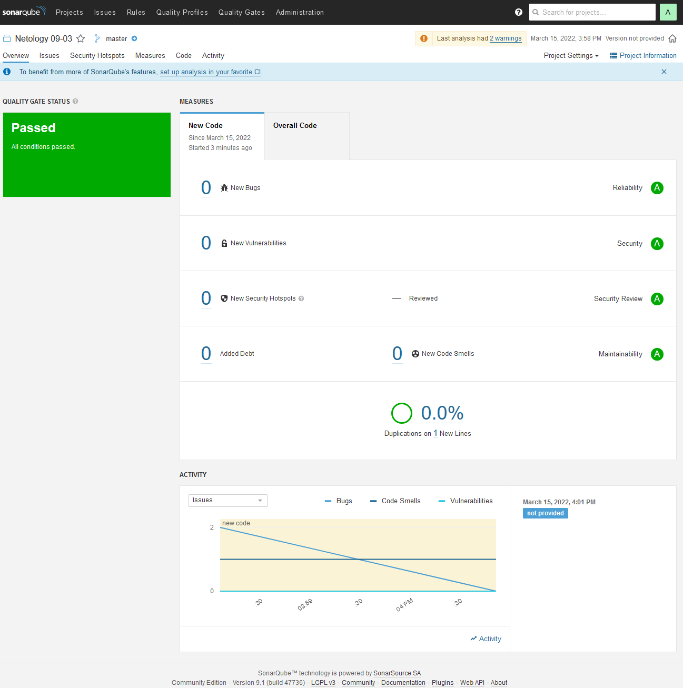

# Домашнее задание к занятию "09.03 CI\CD"

## Знакомоство с SonarQube



## Знакомство с Nexus

### Основная часть

```xml
<?xml version="1.0" encoding="UTF-8"?>
<metadata modelVersion="1.1.0">
  <groupId>netology</groupId>
  <artifactId>java</artifactId>
  <versioning>
    <latest>8_282</latest>
    <release>8_282</release>
    <versions>
      <version>8_102</version>
      <version>8_282</version>
    </versions>
    <lastUpdated>20220315131802</lastUpdated>
  </versioning>
</metadata>
```
[maven-metadata.xml](img/maven-metadata.xml)

### Знакомство с Maven

### Подготовка к выполнению

```bash
$ mvn --version

Apache Maven 3.8.5 (3599d3414f046de2324203b78ddcf9b5e4388aa0)
Maven home: /home/andrey/work/netology/devops-12/apache-maven-3.8.5
Java version: 11.0.14.1, vendor: Eclipse Adoptium, runtime: /home/andrey/work/netology/devops-12/sonar-scanner-4.7.0.2747-linux/jre
Default locale: en, platform encoding: UTF-8
OS name: "linux", version: "5.10.60.1-microsoft-standard-wsl2", arch: "amd64", family: "unix"
```

### Основная часть

```xml
<project xmlns="http://maven.apache.org/POM/4.0.0" xmlns:xsi="http://www.w3.org/2001/XMLSchema-instance"
  xsi:schemaLocation="http://maven.apache.org/POM/4.0.0 http://maven.apache.org/xsd/maven-4.0.0.xsd">
  <modelVersion>4.0.0</modelVersion>
 
  <groupId>com.netology.app</groupId>
  <artifactId>simple-app</artifactId>
  <version>1.0-SNAPSHOT</version>
   <repositories>
    <repository>
      <id>my-repo</id>
      <name>maven-public</name>
      <url>http://178.154.193.23:8081/repository/maven-public/</url>
    </repository>
  </repositories>
  <dependencies>
     <dependency>
      <groupId>netology</groupId>
      <artifactId>java</artifactId>
      <version>8_282</version>
      <classifier>distrib</classifier>
      <type>tar.gz</type>
    </dependency>
  </dependencies>
</project>
```

[pom.xml](mvn/pom.xml)

```bash
$mvn package
...
...
[INFO]
[INFO] --------------------< com.netology.app:simple-app >---------------------
[INFO] Building simple-app 1.0-SNAPSHOT
[INFO] --------------------------------[ jar ]---------------------------------
Downloading from my-repo: http://178.154.193.23:8081/repository/maven-public/netology/java/8_282/java-8_282.pom
Downloading from central: https://repo.maven.apache.org/maven2/netology/java/8_282/java-8_282.pom
[WARNING] The POM for netology:java:tar.gz:distrib:8_282 is missing, no dependency information available
Downloading from my-repo: http://178.154.193.23:8081/repository/maven-public/netology/java/8_282/java-8_282-distrib.tar.gz
Downloaded from my-repo: http://178.154.193.23:8081/repository/maven-public/netology/java/8_282/java-8_282-distrib.tar.gz (64 kB at 409 kB/s)
[INFO]
...
...

$ ls -la ~/.m2/repository/netology/java/8_282/
total 84
drwxr-xr-x 2 andrey andrey  4096 Mar 15 16:38 .
drwxr-xr-x 3 andrey andrey  4096 Mar 15 16:38 ..
-rw-r--r-- 1 andrey andrey   175 Mar 15 16:38 _remote.repositories
-rw-r--r-- 1 andrey andrey 63806 Mar 15 16:38 java-8_282-distrib.tar.gz
-rw-r--r-- 1 andrey andrey    40 Mar 15 16:38 java-8_282-distrib.tar.gz.sha1
-rw-r--r-- 1 andrey andrey   392 Mar 15 16:38 java-8_282.pom.lastUpdated
```
