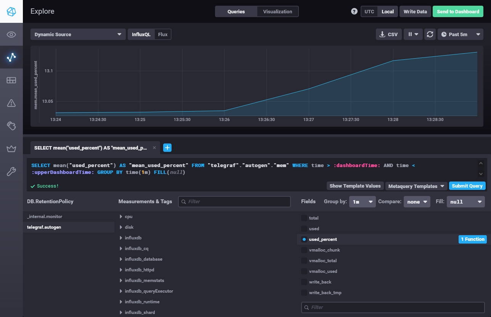

# Домашнее задание к занятию "10.02. Системы мониторинга"

## Обязательные задания

> 1. Опишите основные плюсы и минусы pull и push систем мониторинга.

Как правило, плюсы системы одного вида являются одновременно минусами системы другого вида. Поэтому, имея это в виду, опишем только достоинства систем каждого из видов.

Push-системы самостоятельно устанавливают подключение с наблюдаемого узла к серверу мониторинга. Поэтому её плюсы:

- сервер мониторинга существенно проще в реализации и требует меньше сетевых ресурсов, особенно в случае большого количества узлов для мониторинга (фактически, сервер работает на основе хорошо разработанной технологии web-сервера, и может быть легко масштабирован под большие нагрузки);
- на сервере мониторинга необходимо открывать только входящие сетевые соединения, что упрощает настройку брандмауэра и в принципе сетевую инфраструктуру;
- передача данных идёт только в одну сторону, что позволяет использовать более быстрый и простой протокол UDP;
- подключение нового узла для мониторинга, _в принципе_, сводится только к настройке на самом узле, и не требует настройки сервера (строго говоря, настройка сервера может потребоваться, но она в push-системах всегда существенно проще); 
- все настройки передаваемых данных делаются на самом узле для мониторинга, что может быть в ряде случаев удобнее, например, для административного разделения работ с конечным оборудованием от администрирования сервера мониторинга, либо в случае подстройки режимов мониторинга каждого узла под реально имеющиеся технические возможности (надежность и пропускная способность канала связи, к примеру);
- данные с узла мониторинга можно одновременно передавать на несколько серверов мониторинга, вплоть до использования различных систем мониторинга одновременно.

В pull-системах сервер мониторинга самостоятельно запрашивает данные с узлов для мониторинга, когда ему нужно и в том объёме, который ему нужен. Плюсы таких систем:

- настройка всей системы мониторинга производится централизованно на сервере мониторинга;
- подключение новых узлов для мониторинга сводится только к установке на них ПО, что может быть легко автоматизированно;
- безопасность системы мониторинга существенно выше, потому что список узлов для мониторинга задаётся на сервере, и доступ к ним легче сделать более безопасным путём шифрования трафика;
- также исключается передача данных мониторинга куда-либо, кроме сервера;
- протокол взаимодействия сервера мониторинга и узлов для мониторинга как правило более "человеко-понятен", что упрощает ручную отладку системы.

> 2. Какие из ниже перечисленных систем относятся к push модели, а какие к pull? А может есть гибридные?
> 
>     - Prometheus 
>     - TICK
>     - Zabbix
>     - VictoriaMetrics
>     - Nagios

- Prometeus
  
  Изначально pull-система, к которой можно добавить возможности push-системы при помощи сервиса Pushgateway.

- TICK
  
  InfluxDB, входящий в состав стэка TICK, является чистой push-системой. Однако компонент для сбора метрик Telegraf использует для сбора метрик обе модели одновременно: часть метрик собирается в pull-модели, другие полагаются на push-модель.
  
- Zabbix
  
  В основе своей push-система, которая из коробки имеет возможность настройки pull-запросов к агентам или сторонним источникам данных.

- VictoriaMetrics
  
  Система, которая может функционировать в любой из модели, но только строго в одной, нельзя использовать возможности моделей одновременно. Смена модели требует рестарта.

- Nagios
  
  Чистая pull-система.

> 3. Склонируйте себе [репозиторий](https://github.com/influxdata/sandbox/tree/master) и запустите TICK-стэк, используя технологии docker и docker-compose.

```bash
$ curl -v http://localhost:8086/ping
*   Trying 127.0.0.1:8086...
* TCP_NODELAY set
* Connected to localhost (127.0.0.1) port 8086 (#0)
> GET /ping HTTP/1.1
> Host: localhost:8086
> User-Agent: curl/7.68.0
> Accept: */*
>
* Mark bundle as not supporting multiuse
< HTTP/1.1 204 No Content
< Content-Type: application/json
< Request-Id: 45a59f02-b432-11ec-8064-0242c0a8b004
< X-Influxdb-Build: OSS
< X-Influxdb-Version: 1.8.10
< X-Request-Id: 45a59f02-b432-11ec-8064-0242c0a8b004
< Date: Mon, 04 Apr 2022 16:14:15 GMT
<
* Connection #0 to host localhost left intact
```

```bash
$ curl http://localhost:8888
<!DOCTYPE html><html><head><meta http-equiv="Content-type" content="text/html; charset=utf-8"><title>Chronograf</title><link rel="icon shortcut" href="/favicon.fa749080.ico"><link rel="stylesheet" href="/src.9cea3e4e.css"></head><body> <div id="react-root" data-basepath=""></div> <script src="/src.a969287c.js"></script> </body></html>
```

```bash
$ curl -v http://localhost:9093/kapacitor/v1/ping
*   Trying 127.0.0.1:9093...
* TCP_NODELAY set
* Connected to localhost (127.0.0.1) port 9093 (#0)
> GET /kapacitor/v1/ping HTTP/1.1
> Host: localhost:9093
> User-Agent: curl/7.68.0
> Accept: */*
>
* Mark bundle as not supporting multiuse
< HTTP/1.1 204 No Content
< Content-Type: application/json; charset=utf-8
< Request-Id: 768fc228-b432-11ec-802f-000000000000
< X-Kapacitor-Version: 1.6.4
< Date: Mon, 04 Apr 2022 16:15:37 GMT
<
* Connection #0 to host localhost left intact
```


>4. Перейдите в веб-интерфейс Chronograf (`http://localhost:8888`) и откройте вкладку `Data explorer`.
>
>    - Нажмите на кнопку `Add a query`
>    - Изучите вывод интерфейса и выберите БД `telegraf.autogen`
>    - В `measurments` выберите mem->host->telegraf_container_id , а в `fields` выберите used_percent. 
>    Внизу появится график утилизации оперативной памяти в контейнере telegraf.
>    - Вверху вы можете увидеть запрос, аналогичный SQL-синтаксису. 
>    Поэкспериментируйте с запросом, попробуйте изменить группировку и интервал наблюдений.

С настройками по умолчанию Telegraf не собирает метрики по оперативной памяти и диску. Чтобы включить их сбор, потребовалось в файл настроек Telegraf `telegraf.conf` добавить строки:
```editorconfig
[[inputs.disk]]
[[inputs.mem]]
```
Поскольку по умолчанию Telegraf собирает метрики раз в 5 секунд, делать интервал группировки меньше смысла не имеет. Если сделать его больше, например, 1 минута - на графике видим "сглаживание" кривой. Использование различных доступных группировочных функций (`mean`, `max, `min` и др.) в тестовой конфигурации смысла не имеет, поскольку мы наблюдаем только за одним хостом, и результаты не меняются. Можно применить функцию `count` чтобы убедиться, что данные по мониторингу приходят регулярно и без потерь.





> 5. Изучите список [telegraf inputs](https://github.com/influxdata/telegraf/tree/master/plugins/inputs). 
> Добавьте в конфигурацию telegraf следующий плагин - [docker](https://github.com/influxdata/telegraf/tree/master/plugins/inputs/docker):
> ```
> [[inputs.docker]]
>   endpoint = "unix:///var/run/docker.sock"
> ```

