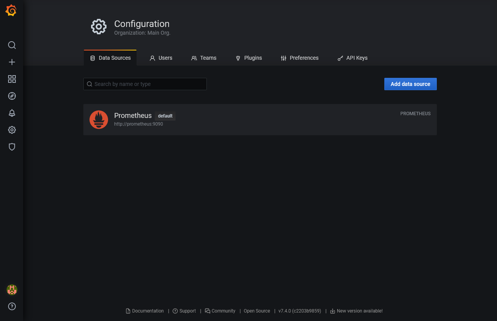
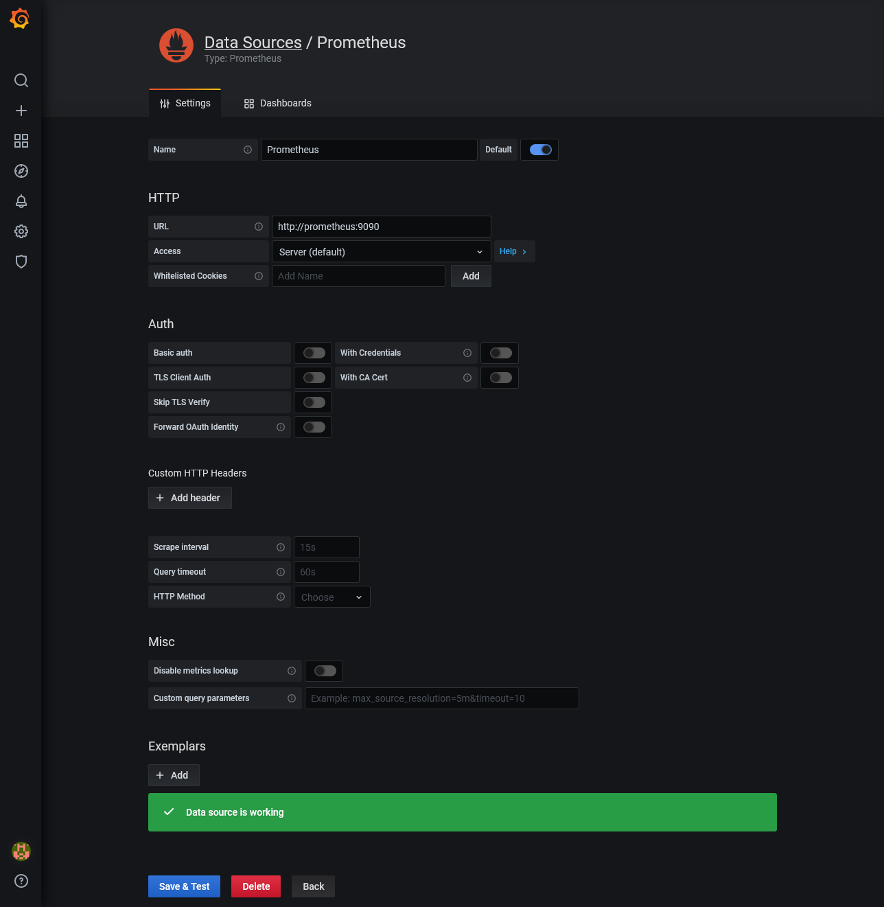
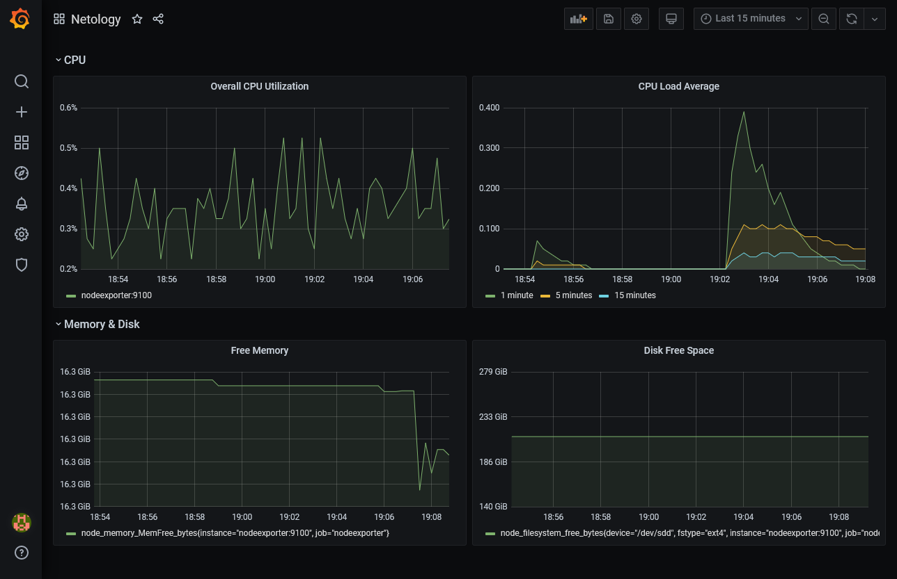
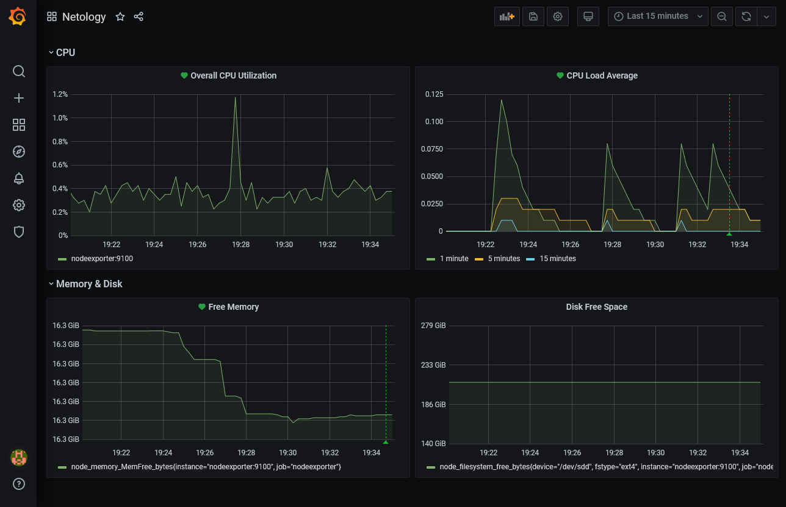

# Домашнее задание к занятию "10.03. Grafana"

### Задание 1
> Используя директорию [help](./help) внутри данного домашнего задания - запустите связку prometheus-grafana.
> 
> Зайдите в веб-интерфейс графана, используя авторизационные данные, указанные в манифесте docker-compose.
> 
> Подключите поднятый вами prometheus как источник данных.
> 
> Решение домашнего задания - скриншот веб-интерфейса grafana со списком подключенных Datasource.

## Задание 2
> Изучите самостоятельно ресурсы:
> - [promql-for-humans](https://timber.io/blog/promql-for-humans/#cpu-usage-by-instance)
> - [understanding prometheus cpu metrics](https://www.robustperception.io/understanding-machine-cpu-usage)
> 
> Создайте Dashboard и в ней создайте следующие Panels:
> - Утилизация CPU для nodeexporter (в процентах, 100-idle)
> - CPULA 1/5/15
> - Количество свободной оперативной памяти
> - Количество места на файловой системе

- Утилизация CPU для nodeexporter (в процентах, 100-idle)
  
  `100 * (1 - avg by(instance)(irate(node_cpu_seconds_total{job="nodeexporter",mode="idle"}[5m])))`
  

- CPULA 1/5/15
  
  `node_load1{job="nodeexporter"}`, `node_load5{job="nodeexporter"}`, `node_load15{job="nodeexporter"}`
  

- Количество свободной оперативной памяти
  
  `node_memory_MemFree_bytes{job="nodeexporter"}`
  

- Количество места на файловой системе
  
  `node_filesystem_free_bytes{job="nodeexporter",mountpoint="/"}`

## Задание 3
> Создайте для каждой Dashboard подходящее правило alert (можно обратиться к первой лекции в блоке "Мониторинг").

## Задание 4
> Сохраните ваш Dashboard.
> 
> Для этого перейдите в настройки Dashboard, выберите в боковом меню "JSON MODEL".
> 
> Далее скопируйте отображаемое json-содержимое в отдельный файл и сохраните его.

[Dashboard](dashboard.json)
