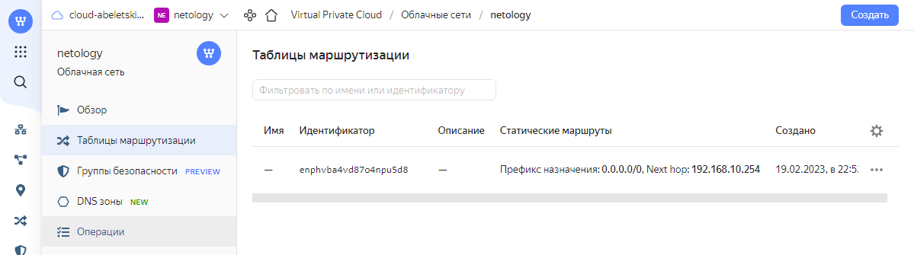

# Домашнее задание к занятию "15.1. Организация сети"

---
## Задание 1. Яндекс.Облако (обязательное к выполнению)

> 1. Создать VPC.
> - Создать пустую VPC. Выбрать зону.
 
> 2. Публичная подсеть.
> - Создать в vpc subnet с названием public, сетью 192.168.10.0/24.
> - Создать в этой подсети NAT-инстанс, присвоив ему адрес 192.168.10.254. В качестве image_id использовать fd80mrhj8fl2oe87o4e1
> - Создать в этой публичной подсети виртуалку с публичным IP и подключиться к ней, убедиться что есть доступ к интернету.

> 3. Приватная подсеть.
> - Создать в vpc subnet с названием private, сетью 192.168.20.0/24.
> - Создать route table. Добавить статический маршрут, направляющий весь исходящий трафик private сети в NAT-инстанс
> - Создать в этой приватной подсети виртуалку с внутренним IP, подключиться к ней через виртуалку, созданную ранее и убедиться что есть доступ к интернету

В результате выполнения данного домашнего задания была создана следующая [конфигурация Terraform](terraform/main.tf).

После применения данной конфигурации получаем следующие результаты:
<details>
    <summary>План</summary>

```bash
Terraform used the selected providers to generate the following execution plan. Resource actions are indicated with the following symbols:
  + create

Terraform will perform the following actions:

  # yandex_compute_instance.nat will be created
  + resource "yandex_compute_instance" "nat" {
      + created_at                = (known after apply)
      + folder_id                 = (known after apply)
      + fqdn                      = (known after apply)
      + hostname                  = (known after apply)
      + id                        = (known after apply)
      + metadata                  = {
          + "ssh-keys" = <<-EOT
                user:ssh-ed25519 AAAAC3NzaC1lZDI1NTE5AAAAIMms+VofMVXYt1it7nXIgRg5m1zfO0W7nG+uVyjks9e9 abeletsky@gmail.com
            EOT
        }
      + name                      = "nat"
      + network_acceleration_type = "standard"
      + platform_id               = "standard-v1"
      + service_account_id        = (known after apply)
      + status                    = (known after apply)
      + zone                      = (known after apply)

      + boot_disk {
          + auto_delete = true
          + device_name = (known after apply)
          + disk_id     = (known after apply)
          + mode        = (known after apply)

          + initialize_params {
              + block_size  = (known after apply)
              + description = (known after apply)
              + image_id    = "fd80mrhj8fl2oe87o4e1"
              + name        = (known after apply)
              + size        = (known after apply)
              + snapshot_id = (known after apply)
              + type        = "network-hdd"
            }
        }

      + metadata_options {
          + aws_v1_http_endpoint = (known after apply)
          + aws_v1_http_token    = (known after apply)
          + gce_http_endpoint    = (known after apply)
          + gce_http_token       = (known after apply)
        }

      + network_interface {
          + index              = (known after apply)
          + ip_address         = "192.168.10.254"
          + ipv4               = true
          + ipv6               = (known after apply)
          + ipv6_address       = (known after apply)
          + mac_address        = (known after apply)
          + nat                = true
          + nat_ip_address     = (known after apply)
          + nat_ip_version     = (known after apply)
          + security_group_ids = (known after apply)
          + subnet_id          = (known after apply)
        }

      + placement_policy {
          + host_affinity_rules = (known after apply)
          + placement_group_id  = (known after apply)
        }

      + resources {
          + core_fraction = 20
          + cores         = 2
          + memory        = 1
        }

      + scheduling_policy {
          + preemptible = (known after apply)
        }
    }

  # yandex_compute_instance.vm-private will be created
  + resource "yandex_compute_instance" "vm-private" {
      + created_at                = (known after apply)
      + folder_id                 = (known after apply)
      + fqdn                      = (known after apply)
      + hostname                  = (known after apply)
      + id                        = (known after apply)
      + metadata                  = {
          + "ssh-keys" = <<-EOT
                user:ssh-ed25519 AAAAC3NzaC1lZDI1NTE5AAAAIMms+VofMVXYt1it7nXIgRg5m1zfO0W7nG+uVyjks9e9 abeletsky@gmail.com
            EOT
        }
      + name                      = "vm-private"
      + network_acceleration_type = "standard"
      + platform_id               = "standard-v1"
      + service_account_id        = (known after apply)
      + status                    = (known after apply)
      + zone                      = (known after apply)

      + boot_disk {
          + auto_delete = true
          + device_name = (known after apply)
          + disk_id     = (known after apply)
          + mode        = (known after apply)

          + initialize_params {
              + block_size  = (known after apply)
              + description = (known after apply)
              + image_id    = "fd8emvfmfoaordspe1jr"
              + name        = (known after apply)
              + size        = (known after apply)
              + snapshot_id = (known after apply)
              + type        = "network-hdd"
            }
        }

      + metadata_options {
          + aws_v1_http_endpoint = (known after apply)
          + aws_v1_http_token    = (known after apply)
          + gce_http_endpoint    = (known after apply)
          + gce_http_token       = (known after apply)
        }

      + network_interface {
          + index              = (known after apply)
          + ip_address         = (known after apply)
          + ipv4               = true
          + ipv6               = (known after apply)
          + ipv6_address       = (known after apply)
          + mac_address        = (known after apply)
          + nat                = false
          + nat_ip_address     = (known after apply)
          + nat_ip_version     = (known after apply)
          + security_group_ids = (known after apply)
          + subnet_id          = (known after apply)
        }

      + placement_policy {
          + host_affinity_rules = (known after apply)
          + placement_group_id  = (known after apply)
        }

      + resources {
          + core_fraction = 20
          + cores         = 2
          + memory        = 1
        }

      + scheduling_policy {
          + preemptible = (known after apply)
        }
    }

  # yandex_compute_instance.vm-public will be created
  + resource "yandex_compute_instance" "vm-public" {
      + created_at                = (known after apply)
      + folder_id                 = (known after apply)
      + fqdn                      = (known after apply)
      + hostname                  = (known after apply)
      + id                        = (known after apply)
      + metadata                  = {
          + "ssh-keys" = <<-EOT
                user:ssh-ed25519 AAAAC3NzaC1lZDI1NTE5AAAAIMms+VofMVXYt1it7nXIgRg5m1zfO0W7nG+uVyjks9e9 abeletsky@gmail.com
            EOT
        }
      + name                      = "vm-public"
      + network_acceleration_type = "standard"
      + platform_id               = "standard-v1"
      + service_account_id        = (known after apply)
      + status                    = (known after apply)
      + zone                      = (known after apply)

      + boot_disk {
          + auto_delete = true
          + device_name = (known after apply)
          + disk_id     = (known after apply)
          + mode        = (known after apply)

          + initialize_params {
              + block_size  = (known after apply)
              + description = (known after apply)
              + image_id    = "fd8emvfmfoaordspe1jr"
              + name        = (known after apply)
              + size        = (known after apply)
              + snapshot_id = (known after apply)
              + type        = "network-hdd"
            }
        }

      + metadata_options {
          + aws_v1_http_endpoint = (known after apply)
          + aws_v1_http_token    = (known after apply)
          + gce_http_endpoint    = (known after apply)
          + gce_http_token       = (known after apply)
        }

      + network_interface {
          + index              = (known after apply)
          + ip_address         = (known after apply)
          + ipv4               = true
          + ipv6               = (known after apply)
          + ipv6_address       = (known after apply)
          + mac_address        = (known after apply)
          + nat                = true
          + nat_ip_address     = (known after apply)
          + nat_ip_version     = (known after apply)
          + security_group_ids = (known after apply)
          + subnet_id          = (known after apply)
        }

      + placement_policy {
          + host_affinity_rules = (known after apply)
          + placement_group_id  = (known after apply)
        }

      + resources {
          + core_fraction = 20
          + cores         = 2
          + memory        = 1
        }

      + scheduling_policy {
          + preemptible = (known after apply)
        }
    }

  # yandex_vpc_network.netology will be created
  + resource "yandex_vpc_network" "netology" {
      + created_at                = (known after apply)
      + default_security_group_id = (known after apply)
      + folder_id                 = (known after apply)
      + id                        = (known after apply)
      + labels                    = (known after apply)
      + name                      = "netology"
      + subnet_ids                = (known after apply)
    }

  # yandex_vpc_route_table.private-to-nat will be created
  + resource "yandex_vpc_route_table" "private-to-nat" {
      + created_at = (known after apply)
      + folder_id  = (known after apply)
      + id         = (known after apply)
      + labels     = (known after apply)
      + network_id = (known after apply)

      + static_route {
          + destination_prefix = "0.0.0.0/0"
          + next_hop_address   = "192.168.10.254"
        }
    }

  # yandex_vpc_subnet.private will be created
  + resource "yandex_vpc_subnet" "private" {
      + created_at     = (known after apply)
      + folder_id      = (known after apply)
      + id             = (known after apply)
      + labels         = (known after apply)
      + name           = "private"
      + network_id     = (known after apply)
      + route_table_id = (known after apply)
      + v4_cidr_blocks = [
          + "192.168.20.0/24",
        ]
      + v6_cidr_blocks = (known after apply)
      + zone           = (known after apply)
    }

  # yandex_vpc_subnet.public will be created
  + resource "yandex_vpc_subnet" "public" {
      + created_at     = (known after apply)
      + folder_id      = (known after apply)
      + id             = (known after apply)
      + labels         = (known after apply)
      + name           = "public"
      + network_id     = (known after apply)
      + v4_cidr_blocks = [
          + "192.168.10.0/24",
        ]
      + v6_cidr_blocks = (known after apply)
      + zone           = (known after apply)
    }

Plan: 7 to add, 0 to change, 0 to destroy.
```
</details>
<details>
    <summary>Результат выполнения</summary>

```bash
yandex_vpc_network.netology: Creating...
yandex_vpc_network.netology: Creation complete after 2s [id=enpgm84fu6ca0pookdjb]
yandex_vpc_subnet.public: Creating...
yandex_vpc_subnet.public: Creation complete after 0s [id=e9b9bgklo0016jfe168i]
yandex_compute_instance.vm-public: Creating...
yandex_compute_instance.nat: Creating...
yandex_compute_instance.nat: Still creating... [10s elapsed]
yandex_compute_instance.vm-public: Still creating... [10s elapsed]
yandex_compute_instance.nat: Still creating... [20s elapsed]
yandex_compute_instance.vm-public: Still creating... [20s elapsed]
yandex_compute_instance.vm-public: Still creating... [30s elapsed]
yandex_compute_instance.nat: Still creating... [30s elapsed]
yandex_compute_instance.vm-public: Creation complete after 33s [id=fhmkpdfc0u4r8qdhoc16]
yandex_compute_instance.nat: Still creating... [40s elapsed]
yandex_compute_instance.nat: Still creating... [50s elapsed]
yandex_compute_instance.nat: Creation complete after 56s [id=fhmroc2ellj0l662l4hf]
yandex_vpc_route_table.private-to-nat: Creating...
yandex_vpc_route_table.private-to-nat: Creation complete after 0s [id=enphvba4vd87o4npu5d8]
yandex_vpc_subnet.private: Creating...
yandex_vpc_subnet.private: Creation complete after 1s [id=e9br6qiqv1vkqcj2g3v7]
yandex_compute_instance.vm-private: Creating...
yandex_compute_instance.vm-private: Still creating... [10s elapsed]
yandex_compute_instance.vm-private: Still creating... [20s elapsed]
yandex_compute_instance.vm-private: Still creating... [30s elapsed]
yandex_compute_instance.vm-private: Creation complete after 30s [id=fhmscc8p52mls644a24g]

Apply complete! Resources: 7 added, 0 changed, 0 destroyed.
```
</details>





Проверим полученный результат. Для этого вначале получим список созданных виртуальных машин:
```bash
$ yc compute instance list

+----------------------+------------+---------------+---------+---------------+----------------+
|          ID          |    NAME    |    ZONE ID    | STATUS  |  EXTERNAL IP  |  INTERNAL IP   |
+----------------------+------------+---------------+---------+---------------+----------------+
| fhmkpdfc0u4r8qdhoc16 | vm-public  | ru-central1-a | RUNNING | 51.250.82.165 | 192.168.10.31  |
| fhmroc2ellj0l662l4hf | nat        | ru-central1-a | RUNNING | 51.250.1.10   | 192.168.10.254 |
| fhmscc8p52mls644a24g | vm-private | ru-central1-a | RUNNING |               | 192.168.20.16  |
+----------------------+------------+---------------+---------+---------------+----------------+
```

Убедимся, что ВМ в публичной подсети имеет доступ к интернету:
```bash
$ ssh -i private-key ubuntu@51.250.82.165

Enter passphrase for key 'private-key':
Welcome to Ubuntu 22.04.1 LTS (GNU/Linux 5.15.0-58-generic x86_64)

 * Documentation:  https://help.ubuntu.com
 * Management:     https://landscape.canonical.com
 * Support:        https://ubuntu.com/advantage

  System information as of Sun Feb 19 08:01:12 PM UTC 2023

  System load:  0.16455078125     Processes:             174
  Usage of /:   85.0% of 4.84GB   Users logged in:       0
  Memory usage: 21%               IPv4 address for eth0: 192.168.10.31
  Swap usage:   0%


0 updates can be applied immediately.


The list of available updates is more than a week old.
To check for new updates run: sudo apt update


The programs included with the Ubuntu system are free software;
the exact distribution terms for each program are described in the
individual files in /usr/share/doc/*/copyright.

Ubuntu comes with ABSOLUTELY NO WARRANTY, to the extent permitted by
applicable law.

To run a command as administrator (user "root"), use "sudo <command>".
See "man sudo_root" for details.

ubuntu@fhmkpdfc0u4r8qdhoc16:~$ curl ifconfig.co

51.250.82.165
```

Находясь внутри ВМ в публичной подсети, подключимся к ВМ в приватной подсети (для этого сначала придётся создать внутри публичной ВМ секретный ключ):
```bash
ubuntu@fhmkpdfc0u4r8qdhoc16:~$ nano ~/.ssh/private-key
ubuntu@fhmkpdfc0u4r8qdhoc16:~$ chmod 600 ~/.ssh/private-key
ubuntu@fhmkpdfc0u4r8qdhoc16:~$ ssh -i ~/.ssh/private-key ubuntu@192.168.20.16

The authenticity of host '192.168.20.16 (192.168.20.16)' can't be established.
ED25519 key fingerprint is SHA256:VjBPp0iPMYIiHgAKi9dEcAD2t8qlQO7KDRspH+Q2zqw.
This key is not known by any other names
Are you sure you want to continue connecting (yes/no/[fingerprint])? yes
Warning: Permanently added '192.168.20.16' (ED25519) to the list of known hosts.
Enter passphrase for key '/home/ubuntu/.ssh/private-key':

Welcome to Ubuntu 22.04.1 LTS (GNU/Linux 5.15.0-58-generic x86_64)

 * Documentation:  https://help.ubuntu.com
 * Management:     https://landscape.canonical.com
 * Support:        https://ubuntu.com/advantage

  System information as of Sun Feb 19 08:04:27 PM UTC 2023

  System load:  0.0009765625      Processes:             130
  Usage of /:   85.0% of 4.84GB   Users logged in:       0
  Memory usage: 22%               IPv4 address for eth0: 192.168.20.16
  Swap usage:   0%


0 updates can be applied immediately.


The list of available updates is more than a week old.
To check for new updates run: sudo apt update


The programs included with the Ubuntu system are free software;
the exact distribution terms for each program are described in the
individual files in /usr/share/doc/*/copyright.

Ubuntu comes with ABSOLUTELY NO WARRANTY, to the extent permitted by
applicable law.

To run a command as administrator (user "root"), use "sudo <command>".
See "man sudo_root" for details.

ubuntu@fhmscc8p52mls644a24g:~$ ip a s

1: lo: <LOOPBACK,UP,LOWER_UP> mtu 65536 qdisc noqueue state UNKNOWN group default qlen 1000
    link/loopback 00:00:00:00:00:00 brd 00:00:00:00:00:00
    inet 127.0.0.1/8 scope host lo
       valid_lft forever preferred_lft forever
    inet6 ::1/128 scope host
       valid_lft forever preferred_lft forever
2: eth0: <BROADCAST,MULTICAST,UP,LOWER_UP> mtu 1500 qdisc mq state UP group default qlen 1000
    link/ether d0:0d:1c:63:11:92 brd ff:ff:ff:ff:ff:ff
    altname enp138s0
    altname ens8
    inet 192.168.20.16/24 metric 100 brd 192.168.20.255 scope global eth0
       valid_lft forever preferred_lft forever
    inet6 fe80::d20d:1cff:fe63:1192/64 scope link
       valid_lft forever preferred_lft forever
       
ubuntu@fhmscc8p52mls644a24g:~$ curl ifconfig.co

51.250.1.10
```

Таким образом, убеждаемся, что задание выполнено, доступ к интернету есть с обоих ВМ - с публичной непосредственно, а с приватной - через сервис NAT.
