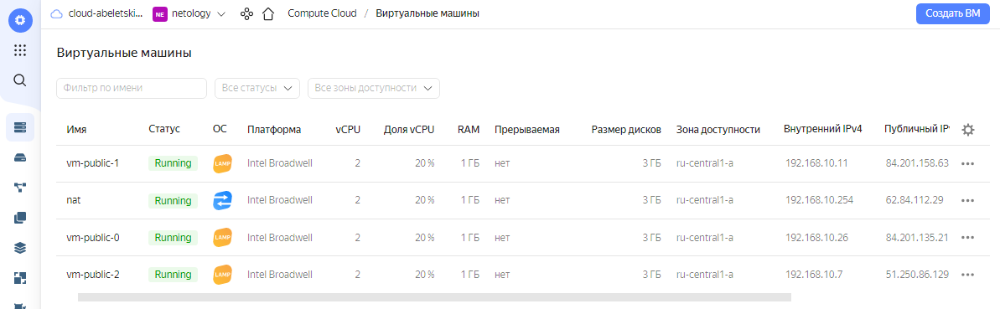

# Домашнее задание к занятию 15.2 "Вычислительные мощности. Балансировщики нагрузки".

> Домашнее задание будет состоять из обязательной части, которую необходимо выполнить на провайдере Яндекс.Облако, и дополнительной части в AWS (можно выполнить по желанию). Все домашние задания в 15 блоке связаны друг с другом и в конце представляют пример законченной инфраструктуры.
> Все задания требуется выполнить с помощью Terraform, результатом выполненного домашнего задания будет код в репозитории. Перед началом работ следует настроить доступ до облачных ресурсов из Terraform, используя материалы прошлых лекций и ДЗ.

---
## Задание 1. Яндекс.Облако (обязательное к выполнению)

> 1. Создать bucket Object Storage и разместить там файл с картинкой:
> - Создать bucket в Object Storage с произвольным именем (например, _имя_студента_дата_);
> - Положить в bucket файл с картинкой;
> - Сделать файл доступным из Интернет.
> 2. Создать группу ВМ в public подсети фиксированного размера с шаблоном LAMP и web-страничкой, содержащей ссылку на картинку из bucket:
> - Создать Instance Group с 3 ВМ и шаблоном LAMP. Для LAMP рекомендуется использовать `image_id = fd827b91d99psvq5fjit`;
> - Для создания стартовой веб-страницы рекомендуется использовать раздел `user_data` в [meta_data](https://cloud.yandex.ru/docs/compute/concepts/vm-metadata);
> - Разместить в стартовой веб-странице шаблонной ВМ ссылку на картинку из bucket;
> - Настроить проверку состояния ВМ.
> 3. Подключить группу к сетевому балансировщику:
> - Создать сетевой балансировщик;
> - Проверить работоспособность, удалив одну или несколько ВМ.

В результате выполнения домашнего задания была создана следующая [конфигурация Terraform](terraform/main.tf).

Применение данной конфигурации даёт следующий результат:

<details>
    <summary>План</summary>

```bash
Terraform used the selected providers to generate the following execution plan. Resource actions are indicated with the following symbols:
  + create

Terraform will perform the following actions:

  # yandex_compute_instance.nat will be created
  + resource "yandex_compute_instance" "nat" {
      + created_at                = (known after apply)
      + folder_id                 = (known after apply)
      + fqdn                      = (known after apply)
      + hostname                  = (known after apply)
      + id                        = (known after apply)
      + metadata                  = {
          + "ssh-keys" = <<-EOT
                user:ssh-ed25519 AAAAC3NzaC1lZDI1NTE5AAAAIMms+VofMVXYt1it7nXIgRg5m1zfO0W7nG+uVyjks9e9 abeletsky@gmail.com
            EOT
        }
      + name                      = "nat"
      + network_acceleration_type = "standard"
      + platform_id               = "standard-v1"
      + service_account_id        = (known after apply)
      + status                    = (known after apply)
      + zone                      = (known after apply)

      + boot_disk {
          + auto_delete = true
          + device_name = (known after apply)
          + disk_id     = (known after apply)
          + mode        = (known after apply)

          + initialize_params {
              + block_size  = (known after apply)
              + description = (known after apply)
              + image_id    = "fd80mrhj8fl2oe87o4e1"
              + name        = (known after apply)
              + size        = (known after apply)
              + snapshot_id = (known after apply)
              + type        = "network-hdd"
            }
        }

      + metadata_options {
          + aws_v1_http_endpoint = (known after apply)
          + aws_v1_http_token    = (known after apply)
          + gce_http_endpoint    = (known after apply)
          + gce_http_token       = (known after apply)
        }

      + network_interface {
          + index              = (known after apply)
          + ip_address         = "192.168.10.254"
          + ipv4               = true
          + ipv6               = (known after apply)
          + ipv6_address       = (known after apply)
          + mac_address        = (known after apply)
          + nat                = true
          + nat_ip_address     = (known after apply)
          + nat_ip_version     = (known after apply)
          + security_group_ids = (known after apply)
          + subnet_id          = (known after apply)
        }

      + placement_policy {
          + host_affinity_rules = (known after apply)
          + placement_group_id  = (known after apply)
        }

      + resources {
          + core_fraction = 20
          + cores         = 2
          + memory        = 1
        }

      + scheduling_policy {
          + preemptible = (known after apply)
        }
    }

  # yandex_compute_instance.vm-public[0] will be created
  + resource "yandex_compute_instance" "vm-public" {
      + created_at                = (known after apply)
      + folder_id                 = (known after apply)
      + fqdn                      = (known after apply)
      + hostname                  = (known after apply)
      + id                        = (known after apply)
      + metadata                  = {
          + "user-data" = <<-EOT
                #cloud-config
                users:
                  - name: <username>
                    groups: sudo
                    shell: /bin/bash
                    sudo: ['ALL=(ALL) NOPASSWD:ALL']
                    ssh-authorized-keys:
                      - ssh-ed25519 AAAAC3NzaC1lZDI1NTE5AAAAIMms+VofMVXYt1it7nXIgRg5m1zfO0W7nG+uVyjks9e9 abeletsky@gmail.com
                write_files:
                - encoding: b64
                  content: PGh0bWw+CjxoZWFkPgogICAgPHRpdGxlPk5ldG9sb2d5IERldk9wcy0xNSBIb21ld29yayAxNS0wMiBTZXJ2ZXIgMDwvdGl0bGU+CjwvaGVhZD4KPGJvZHk+CiAgICA8Y2VudGVyPgogICAgICAgIDxoMT5OZXRvbG9neSBEZXZPcHMtMTUgSG9tZXdvcmsgMTUtMDIgU2VydmVyIDA8L2gxPgogICAgICAgIDxpbWcgc3JjPSJodHRwczovL3N0b3JhZ2UueWFuZGV4Y2xvdWQubmV0L2FiZWxldHNraXkucHByLnJ1LTIwMjMwMjA1L2xha2UiIC8+CiAgICA8L2NlbnRlcj4KPC9ib2R5Pgo8L2h0bWw+Cg==
                  owner: ubuntu:www-data
                  path: /var/www/html/index.html
                  permissions: "0644"
            EOT
        }
      + name                      = "vm-public-0"
      + network_acceleration_type = "standard"
      + platform_id               = "standard-v1"
      + service_account_id        = (known after apply)
      + status                    = (known after apply)
      + zone                      = (known after apply)

      + boot_disk {
          + auto_delete = true
          + device_name = (known after apply)
          + disk_id     = (known after apply)
          + mode        = (known after apply)

          + initialize_params {
              + block_size  = (known after apply)
              + description = (known after apply)
              + image_id    = "fd827b91d99psvq5fjit"
              + name        = (known after apply)
              + size        = (known after apply)
              + snapshot_id = (known after apply)
              + type        = "network-hdd"
            }
        }

      + metadata_options {
          + aws_v1_http_endpoint = (known after apply)
          + aws_v1_http_token    = (known after apply)
          + gce_http_endpoint    = (known after apply)
          + gce_http_token       = (known after apply)
        }

      + network_interface {
          + index              = (known after apply)
          + ip_address         = (known after apply)
          + ipv4               = true
          + ipv6               = (known after apply)
          + ipv6_address       = (known after apply)
          + mac_address        = (known after apply)
          + nat                = true
          + nat_ip_address     = (known after apply)
          + nat_ip_version     = (known after apply)
          + security_group_ids = (known after apply)
          + subnet_id          = (known after apply)
        }

      + placement_policy {
          + host_affinity_rules = (known after apply)
          + placement_group_id  = (known after apply)
        }

      + resources {
          + core_fraction = 20
          + cores         = 2
          + memory        = 1
        }

      + scheduling_policy {
          + preemptible = (known after apply)
        }
    }

  # yandex_compute_instance.vm-public[1] will be created
  + resource "yandex_compute_instance" "vm-public" {
      + created_at                = (known after apply)
      + folder_id                 = (known after apply)
      + fqdn                      = (known after apply)
      + hostname                  = (known after apply)
      + id                        = (known after apply)
      + metadata                  = {
          + "user-data" = <<-EOT
                #cloud-config
                users:
                  - name: <username>
                    groups: sudo
                    shell: /bin/bash
                    sudo: ['ALL=(ALL) NOPASSWD:ALL']
                    ssh-authorized-keys:
                      - ssh-ed25519 AAAAC3NzaC1lZDI1NTE5AAAAIMms+VofMVXYt1it7nXIgRg5m1zfO0W7nG+uVyjks9e9 abeletsky@gmail.com
                write_files:
                - encoding: b64
                  content: PGh0bWw+CjxoZWFkPgogICAgPHRpdGxlPk5ldG9sb2d5IERldk9wcy0xNSBIb21ld29yayAxNS0wMiBTZXJ2ZXIgMTwvdGl0bGU+CjwvaGVhZD4KPGJvZHk+CiAgICA8Y2VudGVyPgogICAgICAgIDxoMT5OZXRvbG9neSBEZXZPcHMtMTUgSG9tZXdvcmsgMTUtMDIgU2VydmVyIDE8L2gxPgogICAgICAgIDxpbWcgc3JjPSJodHRwczovL3N0b3JhZ2UueWFuZGV4Y2xvdWQubmV0L2FiZWxldHNraXkucHByLnJ1LTIwMjMwMjA1L2xha2UiIC8+CiAgICA8L2NlbnRlcj4KPC9ib2R5Pgo8L2h0bWw+Cg==
                  owner: ubuntu:www-data
                  path: /var/www/html/index.html
                  permissions: "0644"
            EOT
        }
      + name                      = "vm-public-1"
      + network_acceleration_type = "standard"
      + platform_id               = "standard-v1"
      + service_account_id        = (known after apply)
      + status                    = (known after apply)
      + zone                      = (known after apply)

      + boot_disk {
          + auto_delete = true
          + device_name = (known after apply)
          + disk_id     = (known after apply)
          + mode        = (known after apply)

          + initialize_params {
              + block_size  = (known after apply)
              + description = (known after apply)
              + image_id    = "fd827b91d99psvq5fjit"
              + name        = (known after apply)
              + size        = (known after apply)
              + snapshot_id = (known after apply)
              + type        = "network-hdd"
            }
        }

      + metadata_options {
          + aws_v1_http_endpoint = (known after apply)
          + aws_v1_http_token    = (known after apply)
          + gce_http_endpoint    = (known after apply)
          + gce_http_token       = (known after apply)
        }

      + network_interface {
          + index              = (known after apply)
          + ip_address         = (known after apply)
          + ipv4               = true
          + ipv6               = (known after apply)
          + ipv6_address       = (known after apply)
          + mac_address        = (known after apply)
          + nat                = true
          + nat_ip_address     = (known after apply)
          + nat_ip_version     = (known after apply)
          + security_group_ids = (known after apply)
          + subnet_id          = (known after apply)
        }

      + placement_policy {
          + host_affinity_rules = (known after apply)
          + placement_group_id  = (known after apply)
        }

      + resources {
          + core_fraction = 20
          + cores         = 2
          + memory        = 1
        }

      + scheduling_policy {
          + preemptible = (known after apply)
        }
    }

  # yandex_compute_instance.vm-public[2] will be created
  + resource "yandex_compute_instance" "vm-public" {
      + created_at                = (known after apply)
      + folder_id                 = (known after apply)
      + fqdn                      = (known after apply)
      + hostname                  = (known after apply)
      + id                        = (known after apply)
      + metadata                  = {
          + "user-data" = <<-EOT
                #cloud-config
                users:
                  - name: <username>
                    groups: sudo
                    shell: /bin/bash
                    sudo: ['ALL=(ALL) NOPASSWD:ALL']
                    ssh-authorized-keys:
                      - ssh-ed25519 AAAAC3NzaC1lZDI1NTE5AAAAIMms+VofMVXYt1it7nXIgRg5m1zfO0W7nG+uVyjks9e9 abeletsky@gmail.com
                write_files:
                - encoding: b64
                  content: PGh0bWw+CjxoZWFkPgogICAgPHRpdGxlPk5ldG9sb2d5IERldk9wcy0xNSBIb21ld29yayAxNS0wMiBTZXJ2ZXIgMjwvdGl0bGU+CjwvaGVhZD4KPGJvZHk+CiAgICA8Y2VudGVyPgogICAgICAgIDxoMT5OZXRvbG9neSBEZXZPcHMtMTUgSG9tZXdvcmsgMTUtMDIgU2VydmVyIDI8L2gxPgogICAgICAgIDxpbWcgc3JjPSJodHRwczovL3N0b3JhZ2UueWFuZGV4Y2xvdWQubmV0L2FiZWxldHNraXkucHByLnJ1LTIwMjMwMjA1L2xha2UiIC8+CiAgICA8L2NlbnRlcj4KPC9ib2R5Pgo8L2h0bWw+Cg==
                  owner: ubuntu:www-data
                  path: /var/www/html/index.html
                  permissions: "0644"
            EOT
        }
      + name                      = "vm-public-2"
      + network_acceleration_type = "standard"
      + platform_id               = "standard-v1"
      + service_account_id        = (known after apply)
      + status                    = (known after apply)
      + zone                      = (known after apply)

      + boot_disk {
          + auto_delete = true
          + device_name = (known after apply)
          + disk_id     = (known after apply)
          + mode        = (known after apply)

          + initialize_params {
              + block_size  = (known after apply)
              + description = (known after apply)
              + image_id    = "fd827b91d99psvq5fjit"
              + name        = (known after apply)
              + size        = (known after apply)
              + snapshot_id = (known after apply)
              + type        = "network-hdd"
            }
        }

      + metadata_options {
          + aws_v1_http_endpoint = (known after apply)
          + aws_v1_http_token    = (known after apply)
          + gce_http_endpoint    = (known after apply)
          + gce_http_token       = (known after apply)
        }

      + network_interface {
          + index              = (known after apply)
          + ip_address         = (known after apply)
          + ipv4               = true
          + ipv6               = (known after apply)
          + ipv6_address       = (known after apply)
          + mac_address        = (known after apply)
          + nat                = true
          + nat_ip_address     = (known after apply)
          + nat_ip_version     = (known after apply)
          + security_group_ids = (known after apply)
          + subnet_id          = (known after apply)
        }

      + placement_policy {
          + host_affinity_rules = (known after apply)
          + placement_group_id  = (known after apply)
        }

      + resources {
          + core_fraction = 20
          + cores         = 2
          + memory        = 1
        }

      + scheduling_policy {
          + preemptible = (known after apply)
        }
    }

  # yandex_iam_service_account.images will be created
  + resource "yandex_iam_service_account" "images" {
      + created_at = (known after apply)
      + folder_id  = (known after apply)
      + id         = (known after apply)
      + name       = "images"
    }

  # yandex_iam_service_account_static_access_key.images-static-key will be created
  + resource "yandex_iam_service_account_static_access_key" "images-static-key" {
      + access_key           = (known after apply)
      + created_at           = (known after apply)
      + encrypted_secret_key = (known after apply)
      + id                   = (known after apply)
      + key_fingerprint      = (known after apply)
      + secret_key           = (sensitive value)
      + service_account_id   = (known after apply)
    }

  # yandex_lb_network_load_balancer.public will be created
  + resource "yandex_lb_network_load_balancer" "public" {
      + created_at = (known after apply)
      + folder_id  = (known after apply)
      + id         = (known after apply)
      + name       = "public"
      + type       = "external"

      + attached_target_group {
          + target_group_id = (known after apply)

          + healthcheck {
              + healthy_threshold   = 2
              + interval            = 2
              + name                = "vm-public-http-healthcheck"
              + timeout             = 1
              + unhealthy_threshold = 2

              + http_options {
                  + port = 80
                }
            }
        }

      + listener {
          + name        = "listener"
          + port        = 80
          + protocol    = (known after apply)
          + target_port = (known after apply)
        }
    }

  # yandex_lb_target_group.public will be created
  + resource "yandex_lb_target_group" "public" {
      + created_at = (known after apply)
      + folder_id  = (known after apply)
      + id         = (known after apply)
      + name       = "public"

      + target {
          + address   = (known after apply)
          + subnet_id = (known after apply)
        }
      + target {
          + address   = (known after apply)
          + subnet_id = (known after apply)
        }
      + target {
          + address   = (known after apply)
          + subnet_id = (known after apply)
        }
    }

  # yandex_resourcemanager_folder_iam_member.images-role will be created
  + resource "yandex_resourcemanager_folder_iam_member" "images-role" {
      + folder_id = "b1g6epmj962blmue7h4s"
      + id        = (known after apply)
      + member    = (known after apply)
      + role      = "storage.admin"
    }

  # yandex_storage_bucket.images will be created
  + resource "yandex_storage_bucket" "images" {
      + access_key            = (known after apply)
      + acl                   = "public-read"
      + bucket                = "abeletskiy.ppr.ru-20230205"
      + bucket_domain_name    = (known after apply)
      + default_storage_class = (known after apply)
      + folder_id             = (known after apply)
      + force_destroy         = false
      + id                    = (known after apply)
      + secret_key            = (sensitive value)
      + website_domain        = (known after apply)
      + website_endpoint      = (known after apply)

      + anonymous_access_flags {
          + config_read = (known after apply)
          + list        = (known after apply)
          + read        = (known after apply)
        }

      + grant {
          + id          = (known after apply)
          + permissions = (known after apply)
          + type        = (known after apply)
          + uri         = (known after apply)
        }

      + versioning {
          + enabled = (known after apply)
        }
    }

  # yandex_storage_object.lake will be created
  + resource "yandex_storage_object" "lake" {
      + access_key                    = (known after apply)
      + acl                           = "private"
      + bucket                        = "abeletskiy.ppr.ru-20230205"
      + content_type                  = (known after apply)
      + id                            = (known after apply)
      + key                           = "lake"
      + object_lock_legal_hold_status = "OFF"
      + secret_key                    = (sensitive value)
      + source                        = "lake.jpg"
    }

  # yandex_vpc_network.netology will be created
  + resource "yandex_vpc_network" "netology" {
      + created_at                = (known after apply)
      + default_security_group_id = (known after apply)
      + folder_id                 = (known after apply)
      + id                        = (known after apply)
      + labels                    = (known after apply)
      + name                      = "netology"
      + subnet_ids                = (known after apply)
    }

  # yandex_vpc_subnet.public will be created
  + resource "yandex_vpc_subnet" "public" {
      + created_at     = (known after apply)
      + folder_id      = (known after apply)
      + id             = (known after apply)
      + labels         = (known after apply)
      + name           = "public"
      + network_id     = (known after apply)
      + v4_cidr_blocks = [
          + "192.168.10.0/24",
        ]
      + v6_cidr_blocks = (known after apply)
      + zone           = (known after apply)
    }

Plan: 13 to add, 0 to change, 0 to destroy.
```
</details>
<details>
    <summary>Результат выполнения</summary>

```bash
yandex_iam_service_account.images: Creating...
yandex_vpc_network.netology: Creating...
yandex_vpc_network.netology: Creation complete after 1s [id=enpim3j41octrgcevdv7]
yandex_vpc_subnet.public: Creating...
yandex_iam_service_account.images: Creation complete after 2s [id=ajenfsqfa2ti9vd35ql7]
yandex_iam_service_account_static_access_key.images-static-key: Creating...
yandex_resourcemanager_folder_iam_member.images-role: Creating...
yandex_vpc_subnet.public: Creation complete after 1s [id=e9b6vem7dhbuim1bpc10]
yandex_compute_instance.nat: Creating...
yandex_compute_instance.vm-public[1]: Creating...
yandex_compute_instance.vm-public[0]: Creating...
yandex_compute_instance.vm-public[2]: Creating...
yandex_iam_service_account_static_access_key.images-static-key: Creation complete after 0s [id=ajeak3b1fitl8ttenchc]
yandex_storage_bucket.images: Creating...
yandex_resourcemanager_folder_iam_member.images-role: Creation complete after 1s [id=b1g6epmj962blmue7h4s/storage.admin/serviceAccount:ajenfsqfa2ti9vd35ql7]
yandex_storage_bucket.images: Creation complete after 2s [id=abeletskiy.ppr.ru-20230205]
yandex_storage_object.lake: Creating...
yandex_storage_object.lake: Creation complete after 1s [id=lake]
yandex_compute_instance.vm-public[0]: Still creating... [10s elapsed]
yandex_compute_instance.nat: Still creating... [10s elapsed]
yandex_compute_instance.vm-public[1]: Still creating... [10s elapsed]
yandex_compute_instance.vm-public[2]: Still creating... [10s elapsed]
yandex_compute_instance.vm-public[1]: Still creating... [20s elapsed]
yandex_compute_instance.vm-public[0]: Still creating... [20s elapsed]
yandex_compute_instance.nat: Still creating... [20s elapsed]
yandex_compute_instance.vm-public[2]: Still creating... [20s elapsed]
yandex_compute_instance.nat: Still creating... [30s elapsed]
yandex_compute_instance.vm-public[1]: Still creating... [30s elapsed]
yandex_compute_instance.vm-public[0]: Still creating... [30s elapsed]
yandex_compute_instance.vm-public[2]: Still creating... [30s elapsed]
yandex_compute_instance.vm-public[0]: Still creating... [40s elapsed]
yandex_compute_instance.nat: Still creating... [40s elapsed]
yandex_compute_instance.vm-public[1]: Still creating... [40s elapsed]
yandex_compute_instance.vm-public[2]: Still creating... [40s elapsed]
yandex_compute_instance.vm-public[1]: Still creating... [50s elapsed]
yandex_compute_instance.vm-public[0]: Still creating... [50s elapsed]
yandex_compute_instance.nat: Still creating... [50s elapsed]
yandex_compute_instance.vm-public[2]: Still creating... [50s elapsed]
yandex_compute_instance.vm-public[1]: Creation complete after 56s [id=fhm01952o117ajmh54be]
yandex_compute_instance.vm-public[2]: Creation complete after 1m0s [id=fhmvinm86irbvoqoh6vg]
yandex_compute_instance.nat: Still creating... [1m0s elapsed]
yandex_compute_instance.vm-public[0]: Still creating... [1m0s elapsed]
yandex_compute_instance.vm-public[0]: Creation complete after 1m2s [id=fhmvek5vi79mnnd4o0ff]
yandex_lb_target_group.public: Creating...
yandex_lb_target_group.public: Creation complete after 2s [id=enp2n5hsqo60n967n97e]
yandex_lb_network_load_balancer.public: Creating...
yandex_lb_network_load_balancer.public: Creation complete after 3s [id=enp0b5u556hlc97h46fe]
yandex_compute_instance.nat: Still creating... [1m10s elapsed]
yandex_compute_instance.nat: Still creating... [1m20s elapsed]
yandex_compute_instance.nat: Creation complete after 1m21s [id=fhm22pb8l45uqo4luvmo]
```
</details>





Убеждаемся, что файл доступен из сети интернет:
```bash
$ curl -v -o /dev/null https://storage.yandexcloud.net/abeletskiy.ppr.ru-20230205/lake

  % Total    % Received % Xferd  Average Speed   Time    Time     Time  Current
                                 Dload  Upload   Total   Spent    Left  Speed
  0     0    0     0    0     0      0      0 --:--:-- --:--:-- --:--:--     0*   Trying 213.180.193.243:443...
* TCP_NODELAY set
* Connected to storage.yandexcloud.net (213.180.193.243) port 443 (#0)
* ALPN, offering h2
* ALPN, offering http/1.1
* successfully set certificate verify locations:
*   CAfile: /etc/ssl/certs/ca-certificates.crt
  CApath: /etc/ssl/certs
} [5 bytes data]
* TLSv1.3 (OUT), TLS handshake, Client hello (1):
} [512 bytes data]
* TLSv1.3 (IN), TLS handshake, Server hello (2):
{ [122 bytes data]
* TLSv1.3 (IN), TLS handshake, Encrypted Extensions (8):
{ [15 bytes data]
* TLSv1.3 (IN), TLS handshake, Certificate (11):
{ [4291 bytes data]
* TLSv1.3 (IN), TLS handshake, CERT verify (15):
{ [264 bytes data]
* TLSv1.3 (IN), TLS handshake, Finished (20):
{ [52 bytes data]
* TLSv1.3 (OUT), TLS change cipher, Change cipher spec (1):
} [1 bytes data]
* TLSv1.3 (OUT), TLS handshake, Finished (20):
} [52 bytes data]
* SSL connection using TLSv1.3 / TLS_AES_256_GCM_SHA384
* ALPN, server accepted to use h2
* Server certificate:
*  subject: C=RU; ST=Moscow; L=Moscow; OU=IT; O=Yandex LLC; CN=*.s3.ua.yandexcloud.net
*  start date: Mar  4 19:10:16 2022 GMT
*  expire date: Apr  5 19:10:15 2023 GMT
*  subjectAltName: host "storage.yandexcloud.net" matched cert's "storage.yandexcloud.net"
*  issuer: C=BE; O=GlobalSign nv-sa; CN=GlobalSign RSA OV SSL CA 2018
*  SSL certificate verify ok.
* Using HTTP2, server supports multi-use
* Connection state changed (HTTP/2 confirmed)
* Copying HTTP/2 data in stream buffer to connection buffer after upgrade: len=0
} [5 bytes data]
* Using Stream ID: 1 (easy handle 0x563b107ce8c0)
} [5 bytes data]
> GET /abeletskiy.ppr.ru-20230205/lake HTTP/2
> Host: storage.yandexcloud.net
> user-agent: curl/7.68.0
> accept: */*
>
{ [5 bytes data]
* TLSv1.3 (IN), TLS handshake, Newsession Ticket (4):
{ [249 bytes data]
* TLSv1.3 (IN), TLS handshake, Newsession Ticket (4):
{ [249 bytes data]
* old SSL session ID is stale, removing
{ [5 bytes data]
* Connection state changed (MAX_CONCURRENT_STREAMS == 6)!
} [5 bytes data]
< HTTP/2 200
< server: nginx
< date: Sun, 19 Feb 2023 20:40:51 GMT
< content-type: application/octet-stream
< content-length: 264957
< accept-ranges: bytes
< etag: "6c43ec85f11f7f75d936b5dc24c22c68"
< last-modified: Sun, 19 Feb 2023 20:33:24 GMT
< x-amz-request-id: 8e202b68c1e41444
<
{ [16191 bytes data]
100  258k  100  258k    0     0   495k      0 --:--:-- --:--:-- --:--:--  495k
* Connection #0 to host storage.yandexcloud.net left intact
```


Проверяем доступность каждой из трёх ВМ с web-страницей:
```bash
$ yc compute instance list

+----------------------+-------------+---------------+---------+---------------+----------------+
|          ID          |    NAME     |    ZONE ID    | STATUS  |  EXTERNAL IP  |  INTERNAL IP   |
+----------------------+-------------+---------------+---------+---------------+----------------+
| fhm01952o117ajmh54be | vm-public-1 | ru-central1-a | RUNNING | 84.201.158.63 | 192.168.10.11  |
| fhm22pb8l45uqo4luvmo | nat         | ru-central1-a | RUNNING | 62.84.112.29  | 192.168.10.254 |
| fhmvek5vi79mnnd4o0ff | vm-public-0 | ru-central1-a | RUNNING | 84.201.135.21 | 192.168.10.26  |
| fhmvinm86irbvoqoh6vg | vm-public-2 | ru-central1-a | RUNNING | 51.250.86.129 | 192.168.10.7   |
+----------------------+-------------+---------------+---------+---------------+----------------+
```


Проверяем доступность страницы через балансировщик нагрузки:
```bash
$ yc load-balancer nlb list
+----------------------+--------+-------------+----------+----------------+------------------------+--------+
|          ID          |  NAME  |  REGION ID  |   TYPE   | LISTENER COUNT | ATTACHED TARGET GROUPS | STATUS |
+----------------------+--------+-------------+----------+----------------+------------------------+--------+
| enp0b5u556hlc97h46fe | public | ru-central1 | EXTERNAL |              1 | enp2n5hsqo60n967n97e   | ACTIVE |
+----------------------+--------+-------------+----------+----------------+------------------------+--------+

$ yc load-balancer nlb get enp0b5u556hlc97h46fe

id: enp0b5u556hlc97h46fe
folder_id: b1g6epmj962blmue7h4s
created_at: "2023-02-19T20:34:26Z"
name: public
region_id: ru-central1
status: ACTIVE
type: EXTERNAL
listeners:
  - name: listener
    address: 84.201.130.10
    port: "80"
    protocol: TCP
    target_port: "80"
    ip_version: IPV4
attached_target_groups:
  - target_group_id: enp2n5hsqo60n967n97e
    health_checks:
      - name: vm-public-http-healthcheck
        interval: 2s
        timeout: 1s
        unhealthy_threshold: "2"
        healthy_threshold: "2"
        http_options:
          port: "80"
          path: / 
```


Отключаем первый сервер, и убеждаемся, что запросы через балансировщик нагрузки уходят на второй сервер:


Отключаем второй сервер, и убеждаемся, что запросы через балансировщик нагрузки уходят на третий сервер:


Отключаем третий сервер, и убеждаемся, что теперь запросы обрабатывать некому:


Включаем второй сервер, и проверяем, что балансировщик снова в работе:


Таким образом, сетевой балансировщик успешно работает.
