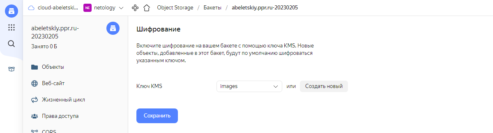

# Домашнее задание к занятию 15.3 "Безопасность в облачных провайдерах"

> Используя конфигурации, выполненные в рамках предыдущих домашних заданиях, нужно добавить возможность шифрования бакета.

---
## Задание 1. Яндекс.Облако (обязательное к выполнению)
1. С помощью ключа в KMS необходимо зашифровать содержимое бакета:
- Создать ключ в KMS,
- С помощью ключа зашифровать содержимое бакета, созданного ранее.

Чтобы выполнить данное задание, необходимо в [конфигурацию, созданную в домашнем задании к заданию 15.2](../15-02/terraform/main.tf), добавить два дополнительных ресурса:
```terraform
resource "yandex_resourcemanager_folder_iam_member" "images-kms" {
  folder_id = var.yc_folder_id
  role      = "kms.keys.encrypterDecrypter"
  member    = "serviceAccount:${yandex_iam_service_account.images.id}"
}

# Static Access Keys
resource "yandex_iam_service_account_static_access_key" "images-static-key" {
  service_account_id = yandex_iam_service_account.images.id
}
```
Результаты применения [итоговой конфигурации](terraform/main.tf) следующие:
<details>
    <summary>План</summary>

```bash
Terraform used the selected providers to generate the following execution plan. Resource actions are indicated with the following symbols:
  + create

Terraform will perform the following actions:

  # yandex_compute_instance.nat will be created
  + resource "yandex_compute_instance" "nat" {
      + created_at                = (known after apply)
      + folder_id                 = (known after apply)
      + fqdn                      = (known after apply)
      + hostname                  = (known after apply)
      + id                        = (known after apply)
      + metadata                  = {
          + "ssh-keys" = <<-EOT
                user:ssh-ed25519 AAAAC3NzaC1lZDI1NTE5AAAAIMms+VofMVXYt1it7nXIgRg5m1zfO0W7nG+uVyjks9e9 abeletsky@gmail.com
            EOT
        }
      + name                      = "nat"
      + network_acceleration_type = "standard"
      + platform_id               = "standard-v1"
      + service_account_id        = (known after apply)
      + status                    = (known after apply)
      + zone                      = (known after apply)

      + boot_disk {
          + auto_delete = true
          + device_name = (known after apply)
          + disk_id     = (known after apply)
          + mode        = (known after apply)

          + initialize_params {
              + block_size  = (known after apply)
              + description = (known after apply)
              + image_id    = "fd80mrhj8fl2oe87o4e1"
              + name        = (known after apply)
              + size        = (known after apply)
              + snapshot_id = (known after apply)
              + type        = "network-hdd"
            }
        }

      + metadata_options {
          + aws_v1_http_endpoint = (known after apply)
          + aws_v1_http_token    = (known after apply)
          + gce_http_endpoint    = (known after apply)
          + gce_http_token       = (known after apply)
        }

      + network_interface {
          + index              = (known after apply)
          + ip_address         = "192.168.10.254"
          + ipv4               = true
          + ipv6               = (known after apply)
          + ipv6_address       = (known after apply)
          + mac_address        = (known after apply)
          + nat                = true
          + nat_ip_address     = (known after apply)
          + nat_ip_version     = (known after apply)
          + security_group_ids = (known after apply)
          + subnet_id          = (known after apply)
        }

      + placement_policy {
          + host_affinity_rules = (known after apply)
          + placement_group_id  = (known after apply)
        }

      + resources {
          + core_fraction = 20
          + cores         = 2
          + memory        = 1
        }

      + scheduling_policy {
          + preemptible = (known after apply)
        }
    }

  # yandex_compute_instance.vm-public[0] will be created
  + resource "yandex_compute_instance" "vm-public" {
      + created_at                = (known after apply)
      + folder_id                 = (known after apply)
      + fqdn                      = (known after apply)
      + hostname                  = (known after apply)
      + id                        = (known after apply)
      + metadata                  = {
          + "user-data" = <<-EOT
                #cloud-config
                users:
                  - name: <username>
                    groups: sudo
                    shell: /bin/bash
                    sudo: ['ALL=(ALL) NOPASSWD:ALL']
                    ssh-authorized-keys:
                      - ssh-ed25519 AAAAC3NzaC1lZDI1NTE5AAAAIMms+VofMVXYt1it7nXIgRg5m1zfO0W7nG+uVyjks9e9 abeletsky@gmail.com
                write_files:
                - encoding: b64
                  content: PGh0bWw+CjxoZWFkPgogICAgPHRpdGxlPk5ldG9sb2d5IERldk9wcy0xNSBIb21ld29yayAxNS0wMiBTZXJ2ZXIgMDwvdGl0bGU+CjwvaGVhZD4KPGJvZHk+CiAgICA8Y2VudGVyPgogICAgICAgIDxoMT5OZXRvbG9neSBEZXZPcHMtMTUgSG9tZXdvcmsgMTUtMDIgU2VydmVyIDA8L2gxPgogICAgICAgIDxpbWcgc3JjPSJodHRwczovL3N0b3JhZ2UueWFuZGV4Y2xvdWQubmV0L2FiZWxldHNraXkucHByLnJ1LTIwMjMwMjA1L2xha2UiIC8+CiAgICA8L2NlbnRlcj4KPC9ib2R5Pgo8L2h0bWw+Cg==
                  owner: ubuntu:www-data
                  path: /var/www/html/index.html
                  permissions: "0644"
            EOT
        }
      + name                      = "vm-public-0"
      + network_acceleration_type = "standard"
      + platform_id               = "standard-v1"
      + service_account_id        = (known after apply)
      + status                    = (known after apply)
      + zone                      = (known after apply)

      + boot_disk {
          + auto_delete = true
          + device_name = (known after apply)
          + disk_id     = (known after apply)
          + mode        = (known after apply)

          + initialize_params {
              + block_size  = (known after apply)
              + description = (known after apply)
              + image_id    = "fd827b91d99psvq5fjit"
              + name        = (known after apply)
              + size        = (known after apply)
              + snapshot_id = (known after apply)
              + type        = "network-hdd"
            }
        }

      + metadata_options {
          + aws_v1_http_endpoint = (known after apply)
          + aws_v1_http_token    = (known after apply)
          + gce_http_endpoint    = (known after apply)
          + gce_http_token       = (known after apply)
        }

      + network_interface {
          + index              = (known after apply)
          + ip_address         = (known after apply)
          + ipv4               = true
          + ipv6               = (known after apply)
          + ipv6_address       = (known after apply)
          + mac_address        = (known after apply)
          + nat                = true
          + nat_ip_address     = (known after apply)
          + nat_ip_version     = (known after apply)
          + security_group_ids = (known after apply)
          + subnet_id          = (known after apply)
        }

      + placement_policy {
          + host_affinity_rules = (known after apply)
          + placement_group_id  = (known after apply)
        }

      + resources {
          + core_fraction = 20
          + cores         = 2
          + memory        = 1
        }

      + scheduling_policy {
          + preemptible = (known after apply)
        }
    }

  # yandex_compute_instance.vm-public[1] will be created
  + resource "yandex_compute_instance" "vm-public" {
      + created_at                = (known after apply)
      + folder_id                 = (known after apply)
      + fqdn                      = (known after apply)
      + hostname                  = (known after apply)
      + id                        = (known after apply)
      + metadata                  = {
          + "user-data" = <<-EOT
                #cloud-config
                users:
                  - name: <username>
                    groups: sudo
                    shell: /bin/bash
                    sudo: ['ALL=(ALL) NOPASSWD:ALL']
                    ssh-authorized-keys:
                      - ssh-ed25519 AAAAC3NzaC1lZDI1NTE5AAAAIMms+VofMVXYt1it7nXIgRg5m1zfO0W7nG+uVyjks9e9 abeletsky@gmail.com
                write_files:
                - encoding: b64
                  content: PGh0bWw+CjxoZWFkPgogICAgPHRpdGxlPk5ldG9sb2d5IERldk9wcy0xNSBIb21ld29yayAxNS0wMiBTZXJ2ZXIgMTwvdGl0bGU+CjwvaGVhZD4KPGJvZHk+CiAgICA8Y2VudGVyPgogICAgICAgIDxoMT5OZXRvbG9neSBEZXZPcHMtMTUgSG9tZXdvcmsgMTUtMDIgU2VydmVyIDE8L2gxPgogICAgICAgIDxpbWcgc3JjPSJodHRwczovL3N0b3JhZ2UueWFuZGV4Y2xvdWQubmV0L2FiZWxldHNraXkucHByLnJ1LTIwMjMwMjA1L2xha2UiIC8+CiAgICA8L2NlbnRlcj4KPC9ib2R5Pgo8L2h0bWw+Cg==
                  owner: ubuntu:www-data
                  path: /var/www/html/index.html
                  permissions: "0644"
            EOT
        }
      + name                      = "vm-public-1"
      + network_acceleration_type = "standard"
      + platform_id               = "standard-v1"
      + service_account_id        = (known after apply)
      + status                    = (known after apply)
      + zone                      = (known after apply)

      + boot_disk {
          + auto_delete = true
          + device_name = (known after apply)
          + disk_id     = (known after apply)
          + mode        = (known after apply)

          + initialize_params {
              + block_size  = (known after apply)
              + description = (known after apply)
              + image_id    = "fd827b91d99psvq5fjit"
              + name        = (known after apply)
              + size        = (known after apply)
              + snapshot_id = (known after apply)
              + type        = "network-hdd"
            }
        }

      + metadata_options {
          + aws_v1_http_endpoint = (known after apply)
          + aws_v1_http_token    = (known after apply)
          + gce_http_endpoint    = (known after apply)
          + gce_http_token       = (known after apply)
        }

      + network_interface {
          + index              = (known after apply)
          + ip_address         = (known after apply)
          + ipv4               = true
          + ipv6               = (known after apply)
          + ipv6_address       = (known after apply)
          + mac_address        = (known after apply)
          + nat                = true
          + nat_ip_address     = (known after apply)
          + nat_ip_version     = (known after apply)
          + security_group_ids = (known after apply)
          + subnet_id          = (known after apply)
        }

      + placement_policy {
          + host_affinity_rules = (known after apply)
          + placement_group_id  = (known after apply)
        }

      + resources {
          + core_fraction = 20
          + cores         = 2
          + memory        = 1
        }

      + scheduling_policy {
          + preemptible = (known after apply)
        }
    }

  # yandex_compute_instance.vm-public[2] will be created
  + resource "yandex_compute_instance" "vm-public" {
      + created_at                = (known after apply)
      + folder_id                 = (known after apply)
      + fqdn                      = (known after apply)
      + hostname                  = (known after apply)
      + id                        = (known after apply)
      + metadata                  = {
          + "user-data" = <<-EOT
                #cloud-config
                users:
                  - name: <username>
                    groups: sudo
                    shell: /bin/bash
                    sudo: ['ALL=(ALL) NOPASSWD:ALL']
                    ssh-authorized-keys:
                      - ssh-ed25519 AAAAC3NzaC1lZDI1NTE5AAAAIMms+VofMVXYt1it7nXIgRg5m1zfO0W7nG+uVyjks9e9 abeletsky@gmail.com
                write_files:
                - encoding: b64
                  content: PGh0bWw+CjxoZWFkPgogICAgPHRpdGxlPk5ldG9sb2d5IERldk9wcy0xNSBIb21ld29yayAxNS0wMiBTZXJ2ZXIgMjwvdGl0bGU+CjwvaGVhZD4KPGJvZHk+CiAgICA8Y2VudGVyPgogICAgICAgIDxoMT5OZXRvbG9neSBEZXZPcHMtMTUgSG9tZXdvcmsgMTUtMDIgU2VydmVyIDI8L2gxPgogICAgICAgIDxpbWcgc3JjPSJodHRwczovL3N0b3JhZ2UueWFuZGV4Y2xvdWQubmV0L2FiZWxldHNraXkucHByLnJ1LTIwMjMwMjA1L2xha2UiIC8+CiAgICA8L2NlbnRlcj4KPC9ib2R5Pgo8L2h0bWw+Cg==
                  owner: ubuntu:www-data
                  path: /var/www/html/index.html
                  permissions: "0644"
            EOT
        }
      + name                      = "vm-public-2"
      + network_acceleration_type = "standard"
      + platform_id               = "standard-v1"
      + service_account_id        = (known after apply)
      + status                    = (known after apply)
      + zone                      = (known after apply)

      + boot_disk {
          + auto_delete = true
          + device_name = (known after apply)
          + disk_id     = (known after apply)
          + mode        = (known after apply)

          + initialize_params {
              + block_size  = (known after apply)
              + description = (known after apply)
              + image_id    = "fd827b91d99psvq5fjit"
              + name        = (known after apply)
              + size        = (known after apply)
              + snapshot_id = (known after apply)
              + type        = "network-hdd"
            }
        }

      + metadata_options {
          + aws_v1_http_endpoint = (known after apply)
          + aws_v1_http_token    = (known after apply)
          + gce_http_endpoint    = (known after apply)
          + gce_http_token       = (known after apply)
        }

      + network_interface {
          + index              = (known after apply)
          + ip_address         = (known after apply)
          + ipv4               = true
          + ipv6               = (known after apply)
          + ipv6_address       = (known after apply)
          + mac_address        = (known after apply)
          + nat                = true
          + nat_ip_address     = (known after apply)
          + nat_ip_version     = (known after apply)
          + security_group_ids = (known after apply)
          + subnet_id          = (known after apply)
        }

      + placement_policy {
          + host_affinity_rules = (known after apply)
          + placement_group_id  = (known after apply)
        }

      + resources {
          + core_fraction = 20
          + cores         = 2
          + memory        = 1
        }

      + scheduling_policy {
          + preemptible = (known after apply)
        }
    }

  # yandex_iam_service_account.images will be created
  + resource "yandex_iam_service_account" "images" {
      + created_at = (known after apply)
      + folder_id  = (known after apply)
      + id         = (known after apply)
      + name       = "images"
    }

  # yandex_iam_service_account_static_access_key.images-static-key will be created
  + resource "yandex_iam_service_account_static_access_key" "images-static-key" {
      + access_key           = (known after apply)
      + created_at           = (known after apply)
      + encrypted_secret_key = (known after apply)
      + id                   = (known after apply)
      + key_fingerprint      = (known after apply)
      + secret_key           = (sensitive value)
      + service_account_id   = (known after apply)
    }

  # yandex_kms_symmetric_key.images will be created
  + resource "yandex_kms_symmetric_key" "images" {
      + created_at        = (known after apply)
      + default_algorithm = "AES_128"
      + folder_id         = (known after apply)
      + id                = (known after apply)
      + name              = "images"
      + rotated_at        = (known after apply)
      + rotation_period   = "8760h"
      + status            = (known after apply)
    }

  # yandex_lb_network_load_balancer.public will be created
  + resource "yandex_lb_network_load_balancer" "public" {
      + created_at = (known after apply)
      + folder_id  = (known after apply)
      + id         = (known after apply)
      + name       = "public"
      + type       = "external"

      + attached_target_group {
          + target_group_id = (known after apply)

          + healthcheck {
              + healthy_threshold   = 2
              + interval            = 2
              + name                = "vm-public-http-healthcheck"
              + timeout             = 1
              + unhealthy_threshold = 2

              + http_options {
                  + port = 80
                }
            }
        }

      + listener {
          + name        = "listener"
          + port        = 80
          + protocol    = (known after apply)
          + target_port = (known after apply)
        }
    }

  # yandex_lb_target_group.public will be created
  + resource "yandex_lb_target_group" "public" {
      + created_at = (known after apply)
      + folder_id  = (known after apply)
      + id         = (known after apply)
      + name       = "public"

      + target {
          + address   = (known after apply)
          + subnet_id = (known after apply)
        }
      + target {
          + address   = (known after apply)
          + subnet_id = (known after apply)
        }
      + target {
          + address   = (known after apply)
          + subnet_id = (known after apply)
        }
    }

  # yandex_resourcemanager_folder_iam_member.images-kms will be created
  + resource "yandex_resourcemanager_folder_iam_member" "images-kms" {
      + folder_id = "b1g6epmj962blmue7h4s"
      + id        = (known after apply)
      + member    = (known after apply)
      + role      = "kms.keys.encrypterDecrypter"
    }

  # yandex_resourcemanager_folder_iam_member.images-storage-editor will be created
  + resource "yandex_resourcemanager_folder_iam_member" "images-storage-editor" {
      + folder_id = "b1g6epmj962blmue7h4s"
      + id        = (known after apply)
      + member    = (known after apply)
      + role      = "storage.editor"
    }

  # yandex_storage_bucket.images will be created
  + resource "yandex_storage_bucket" "images" {
      + access_key            = (known after apply)
      + acl                   = "public-read"
      + bucket                = "abeletskiy.ppr.ru-20230205"
      + bucket_domain_name    = (known after apply)
      + default_storage_class = (known after apply)
      + folder_id             = (known after apply)
      + force_destroy         = false
      + id                    = (known after apply)
      + secret_key            = (sensitive value)
      + website_domain        = (known after apply)
      + website_endpoint      = (known after apply)

      + anonymous_access_flags {
          + config_read = (known after apply)
          + list        = (known after apply)
          + read        = (known after apply)
        }

      + grant {
          + id          = (known after apply)
          + permissions = (known after apply)
          + type        = (known after apply)
          + uri         = (known after apply)
        }

      + server_side_encryption_configuration {
          + rule {
              + apply_server_side_encryption_by_default {
                  + kms_master_key_id = (known after apply)
                  + sse_algorithm     = "aws:kms"
                }
            }
        }

      + versioning {
          + enabled = (known after apply)
        }
    }

  # yandex_storage_object.lake will be created
  + resource "yandex_storage_object" "lake" {
      + access_key                    = (known after apply)
      + acl                           = "private"
      + bucket                        = "abeletskiy.ppr.ru-20230205"
      + content_type                  = (known after apply)
      + id                            = (known after apply)
      + key                           = "lake"
      + object_lock_legal_hold_status = "OFF"
      + secret_key                    = (sensitive value)
      + source                        = "lake.jpg"
    }

  # yandex_vpc_network.netology will be created
  + resource "yandex_vpc_network" "netology" {
      + created_at                = (known after apply)
      + default_security_group_id = (known after apply)
      + folder_id                 = (known after apply)
      + id                        = (known after apply)
      + labels                    = (known after apply)
      + name                      = "netology"
      + subnet_ids                = (known after apply)
    }

  # yandex_vpc_subnet.public will be created
  + resource "yandex_vpc_subnet" "public" {
      + created_at     = (known after apply)
      + folder_id      = (known after apply)
      + id             = (known after apply)
      + labels         = (known after apply)
      + name           = "public"
      + network_id     = (known after apply)
      + v4_cidr_blocks = [
          + "192.168.10.0/24",
        ]
      + v6_cidr_blocks = (known after apply)
      + zone           = (known after apply)
    }

Plan: 15 to add, 0 to change, 0 to destroy.

Do you want to perform these actions?
  Terraform will perform the actions described above.
  Only 'yes' will be accepted to approve.
```
</details>
<details>
    <summary>Результат выполнения</summary>

```bash
yandex_iam_service_account.images: Creating...
yandex_kms_symmetric_key.images: Creating...
yandex_vpc_network.netology: Creating...
yandex_kms_symmetric_key.images: Creation complete after 1s [id=abjbmsqbbuvsus6a1hkp]
yandex_vpc_network.netology: Creation complete after 1s [id=enpu0r4cs5l8g3789ij1]
yandex_vpc_subnet.public: Creating...
yandex_iam_service_account.images: Creation complete after 1s [id=ajec7f4okmbobmrffbqh]
yandex_resourcemanager_folder_iam_member.images-kms: Creating...
yandex_resourcemanager_folder_iam_member.images-storage-editor: Creating...
yandex_iam_service_account_static_access_key.images-static-key: Creating...
yandex_vpc_subnet.public: Creation complete after 1s [id=e9bdglbold2iu78v386k]
yandex_compute_instance.vm-public[1]: Creating...
yandex_compute_instance.nat: Creating...
yandex_compute_instance.vm-public[0]: Creating...
yandex_compute_instance.vm-public[2]: Creating...
yandex_iam_service_account_static_access_key.images-static-key: Creation complete after 1s [id=ajekduhsfq4rds62ivqf]
yandex_storage_bucket.images: Creating...
yandex_resourcemanager_folder_iam_member.images-kms: Creation complete after 2s [id=b1g6epmj962blmue7h4s/kms.keys.encrypterDecrypter/serviceAccount:ajec7f4okmbobmrffbqh]
yandex_resourcemanager_folder_iam_member.images-storage-editor: Creation complete after 3s [id=b1g6epmj962blmue7h4s/storage.editor/serviceAccount:ajec7f4okmbobmrffbqh]
yandex_compute_instance.vm-public[0]: Still creating... [10s elapsed]
yandex_compute_instance.vm-public[1]: Still creating... [10s elapsed]
yandex_compute_instance.nat: Still creating... [10s elapsed]
yandex_compute_instance.vm-public[2]: Still creating... [10s elapsed]
yandex_storage_bucket.images: Still creating... [10s elapsed]
yandex_compute_instance.vm-public[0]: Still creating... [20s elapsed]
yandex_compute_instance.vm-public[1]: Still creating... [20s elapsed]
yandex_compute_instance.nat: Still creating... [20s elapsed]
yandex_compute_instance.vm-public[2]: Still creating... [20s elapsed]
yandex_storage_bucket.images: Still creating... [20s elapsed]
yandex_compute_instance.vm-public[1]: Still creating... [30s elapsed]
yandex_compute_instance.vm-public[0]: Still creating... [30s elapsed]
yandex_compute_instance.nat: Still creating... [30s elapsed]
yandex_compute_instance.vm-public[2]: Still creating... [30s elapsed]
yandex_storage_bucket.images: Still creating... [30s elapsed]
yandex_compute_instance.nat: Still creating... [40s elapsed]
yandex_compute_instance.vm-public[1]: Still creating... [40s elapsed]
yandex_compute_instance.vm-public[0]: Still creating... [40s elapsed]
yandex_compute_instance.vm-public[2]: Still creating... [40s elapsed]
yandex_storage_bucket.images: Still creating... [40s elapsed]
yandex_compute_instance.nat: Still creating... [50s elapsed]
yandex_compute_instance.vm-public[0]: Still creating... [50s elapsed]
yandex_compute_instance.vm-public[1]: Still creating... [50s elapsed]
yandex_compute_instance.vm-public[2]: Still creating... [50s elapsed]
yandex_storage_bucket.images: Still creating... [50s elapsed]
yandex_compute_instance.vm-public[1]: Creation complete after 58s [id=fhmbj6nbll20flrlipuf]
yandex_compute_instance.vm-public[0]: Creation complete after 58s [id=fhmd2tjam03lduu14vf7]
yandex_compute_instance.vm-public[2]: Creation complete after 1m0s [id=fhmejhu2eggeophc4p53]
yandex_compute_instance.nat: Still creating... [1m0s elapsed]
yandex_lb_target_group.public: Creating...
yandex_storage_bucket.images: Still creating... [1m0s elapsed]
yandex_lb_target_group.public: Creation complete after 2s [id=enpv8a3hk6lpti4ai7j8]
yandex_lb_network_load_balancer.public: Creating...
yandex_lb_network_load_balancer.public: Creation complete after 3s [id=enpl59mio3ti77k743g3]
yandex_compute_instance.nat: Creation complete after 1m6s [id=fhms3tuq90rtacnp5jq5]
yandex_storage_bucket.images: Still creating... [1m10s elapsed]
yandex_storage_bucket.images: Still creating... [1m20s elapsed]
yandex_storage_bucket.images: Still creating... [1m30s elapsed]
yandex_storage_bucket.images: Still creating... [1m40s elapsed]
yandex_storage_bucket.images: Still creating... [1m50s elapsed]
yandex_storage_bucket.images: Still creating... [2m0s elapsed]
yandex_storage_bucket.images: Creation complete after 2m7s [id=abeletskiy.ppr.ru-20230205]
yandex_storage_object.lake: Creating...
yandex_storage_object.lake: Creation complete after 0s [id=lake]

Apply complete! Resources: 15 added, 0 changed, 0 destroyed.
```
</details>


