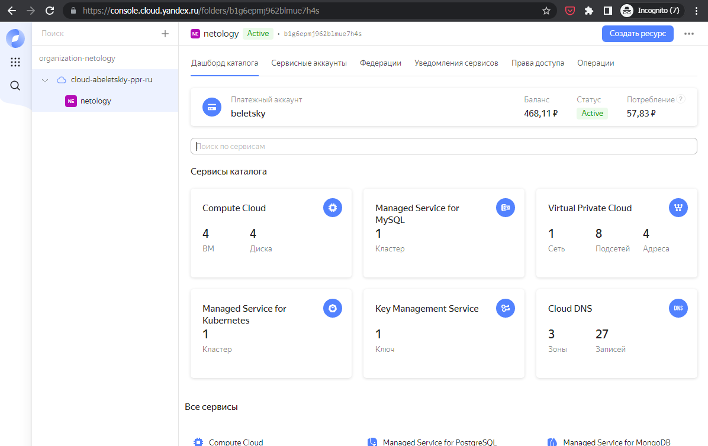
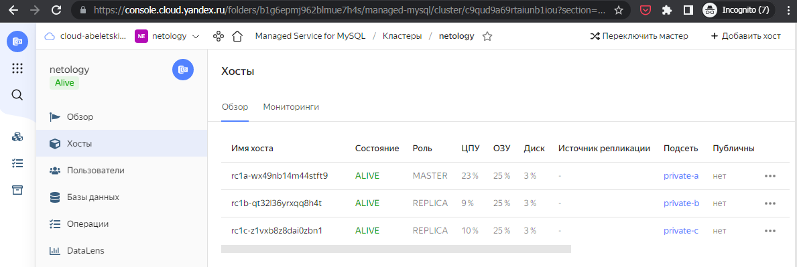
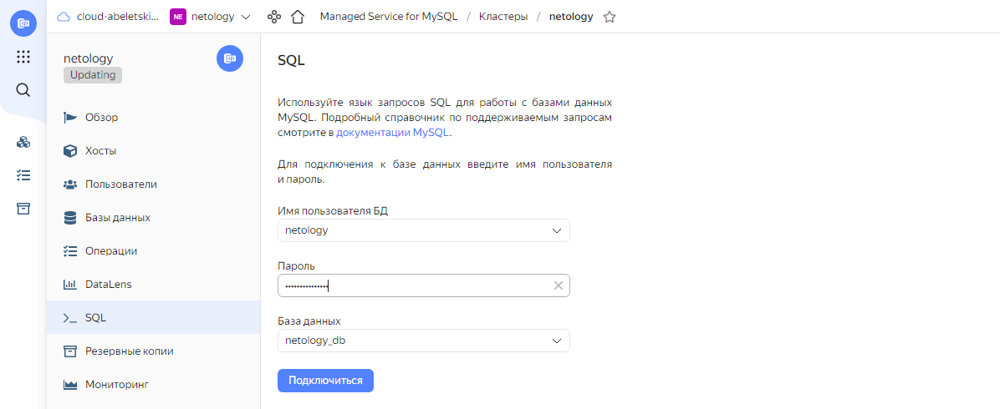
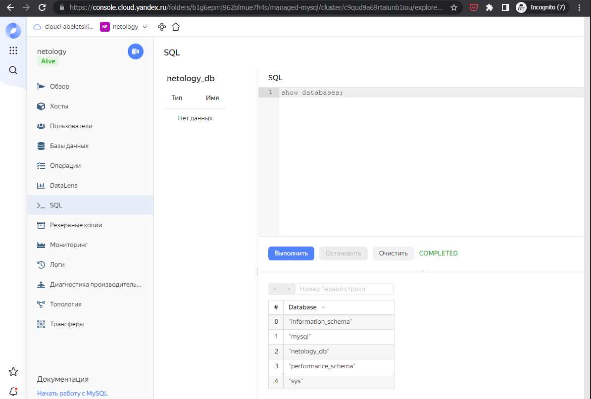
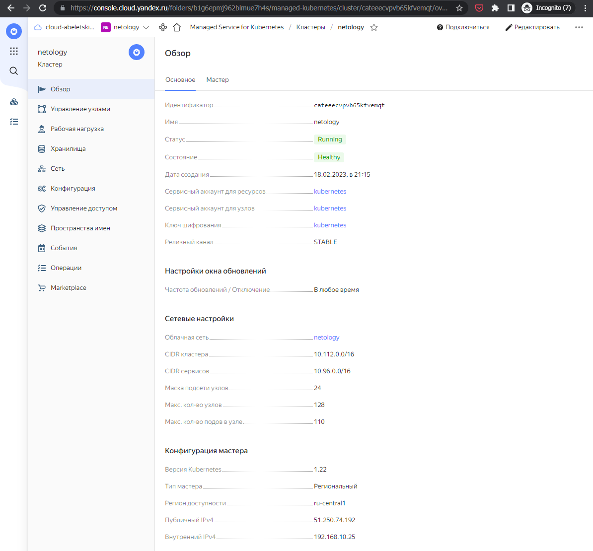
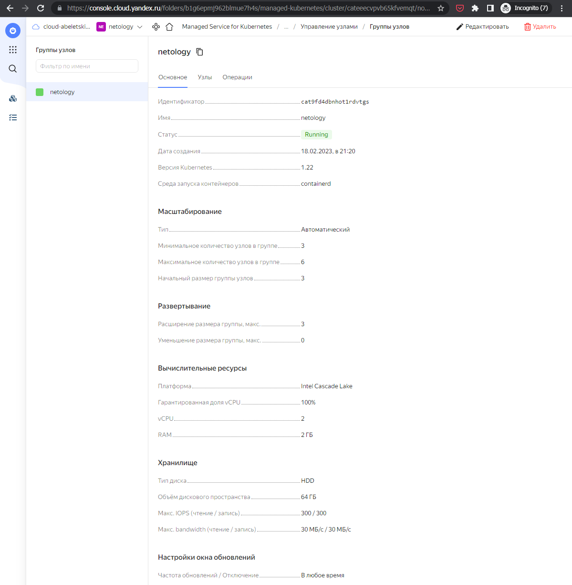
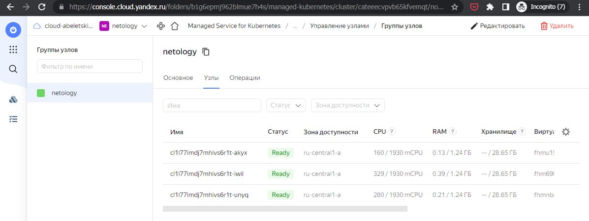

# Домашнее задание к занятию 15.4 "Кластеры. Ресурсы под управлением облачных провайдеров"

> Организация кластера Kubernetes и кластера баз данных MySQL в отказоустойчивой архитектуре.
> Размещение в private подсетях кластера БД, а в public - кластера Kubernetes.

---
## Задание 1. Яндекс.Облако (обязательное к выполнению)

> 1. Настроить с помощью Terraform кластер баз данных MySQL:
> - Используя настройки VPC с предыдущих ДЗ, добавить дополнительно подсеть private в разных зонах, чтобы обеспечить отказоустойчивость 
> - Разместить ноды кластера MySQL в разных подсетях
> - Необходимо предусмотреть репликацию с произвольным временем технического обслуживания
> - Использовать окружение PRESTABLE, платформу Intel Broadwell с производительностью 50% CPU и размером диска 20 Гб
> - Задать время начала резервного копирования - 23:59
> - Включить защиту кластера от непреднамеренного удаления
> - Создать БД с именем `netology_db` c логином и паролем
> 
> 2. Настроить с помощью Terraform кластер Kubernetes
> - Используя настройки VPC с предыдущих ДЗ, добавить дополнительно 2 подсети public в разных зонах, чтобы обеспечить отказоустойчивость
> - Создать отдельный сервис-аккаунт с необходимыми правами 
> - Создать региональный мастер kubernetes с размещением нод в разных 3 подсетях
> - Добавить возможность шифрования ключом из KMS, созданного в предыдущем ДЗ
> - Создать группу узлов состояющую из 3 машин с автомасштабированием до 6
> - Подключиться к кластеру с помощью `kubectl`
> - *Запустить микросервис phpmyadmin и подключиться к БД, созданной ранее
> - *Создать сервис типы Load Balancer и подключиться к phpmyadmin. Предоставить скриншот с публичным адресом и подключением к БД

В результате выполнения данного задания была создана следующая [конфигурация Terraform](terraform/main.tf). Последние два задания второго пункта не выполнялись. Вместо этого непосредственно в панели управления Яндекс.Облака был включён доступ к кластеру MySQL, и в интерактивном режиме показана возможность выполнения SQL-запросов к ней.  

При запуске данной конфигурации на выполнение получаем следующие результаты:

<details>
    <summary>План</summary>

```bash
$ terraform apply

Terraform will perform the following actions:

  # yandex_compute_instance.nat will be created
  + resource "yandex_compute_instance" "nat" {
      + created_at                = (known after apply)
      + folder_id                 = (known after apply)
      + fqdn                      = (known after apply)
      + hostname                  = (known after apply)
      + id                        = (known after apply)
      + metadata                  = {
          + "ssh-keys" = <<-EOT
                user:ssh-ed25519 AAAAC3NzaC1lZDI1NTE5AAAAIMms+VofMVXYt1it7nXIgRg5m1zfO0W7nG+uVyjks9e9 abeletsky@gmail.com
            EOT
        }
      + name                      = "nat"
      + network_acceleration_type = "standard"
      + platform_id               = "standard-v1"
      + service_account_id        = (known after apply)
      + status                    = (known after apply)
      + zone                      = (known after apply)

      + boot_disk {
          + auto_delete = true
          + device_name = (known after apply)
          + disk_id     = (known after apply)
          + mode        = (known after apply)

          + initialize_params {
              + block_size  = (known after apply)
              + description = (known after apply)
              + image_id    = "fd80mrhj8fl2oe87o4e1"
              + name        = (known after apply)
              + size        = (known after apply)
              + snapshot_id = (known after apply)
              + type        = "network-hdd"
            }
        }

      + metadata_options {
          + aws_v1_http_endpoint = (known after apply)
          + aws_v1_http_token    = (known after apply)
          + gce_http_endpoint    = (known after apply)
          + gce_http_token       = (known after apply)
        }

      + network_interface {
          + index              = (known after apply)
          + ip_address         = "192.168.10.254"
          + ipv4               = true
          + ipv6               = (known after apply)
          + ipv6_address       = (known after apply)
          + mac_address        = (known after apply)
          + nat                = true
          + nat_ip_address     = (known after apply)
          + nat_ip_version     = (known after apply)
          + security_group_ids = (known after apply)
          + subnet_id          = (known after apply)
        }

      + placement_policy {
          + host_affinity_rules = (known after apply)
          + placement_group_id  = (known after apply)
        }

      + resources {
          + core_fraction = 20
          + cores         = 2
          + memory        = 1
        }

      + scheduling_policy {
          + preemptible = (known after apply)
        }
    }

  # yandex_iam_service_account.kubernetes will be created
  + resource "yandex_iam_service_account" "kubernetes" {
      + created_at = (known after apply)
      + folder_id  = (known after apply)
      + id         = (known after apply)
      + name       = "kubernetes"
    }

  # yandex_kms_symmetric_key.kubernetes will be created
  + resource "yandex_kms_symmetric_key" "kubernetes" {
      + created_at        = (known after apply)
      + default_algorithm = "AES_128"
      + folder_id         = (known after apply)
      + id                = (known after apply)
      + name              = "kubernetes"
      + rotated_at        = (known after apply)
      + rotation_period   = "8760h"
      + status            = (known after apply)
    }

  # yandex_kms_symmetric_key_iam_binding.kubernetes will be created
  + resource "yandex_kms_symmetric_key_iam_binding" "kubernetes" {
      + id               = (known after apply)
      + members          = (known after apply)
      + role             = "viewer"
      + symmetric_key_id = (known after apply)
    }

  # yandex_kubernetes_cluster.netology will be created
  + resource "yandex_kubernetes_cluster" "netology" {
      + cluster_ipv4_range       = (known after apply)
      + cluster_ipv6_range       = (known after apply)
      + created_at               = (known after apply)
      + description              = (known after apply)
      + folder_id                = (known after apply)
      + health                   = (known after apply)
      + id                       = (known after apply)
      + labels                   = (known after apply)
      + log_group_id             = (known after apply)
      + name                     = "netology"
      + network_id               = (known after apply)
      + node_ipv4_cidr_mask_size = 24
      + node_service_account_id  = (known after apply)
      + release_channel          = "STABLE"
      + service_account_id       = (known after apply)
      + service_ipv4_range       = (known after apply)
      + service_ipv6_range       = (known after apply)
      + status                   = (known after apply)

      + kms_provider {
          + key_id = (known after apply)
        }

      + master {
          + cluster_ca_certificate = (known after apply)
          + external_v4_address    = (known after apply)
          + external_v4_endpoint   = (known after apply)
          + external_v6_endpoint   = (known after apply)
          + internal_v4_address    = (known after apply)
          + internal_v4_endpoint   = (known after apply)
          + public_ip              = true
          + version                = "1.22"
          + version_info           = (known after apply)

          + maintenance_policy {
              + auto_upgrade = (known after apply)

              + maintenance_window {
                  + day        = (known after apply)
                  + duration   = (known after apply)
                  + start_time = (known after apply)
                }
            }

          + regional {
              + region = "ru-central1"

              + location {
                  + subnet_id = (known after apply)
                  + zone      = "ru-central1-a"
                }
              + location {
                  + subnet_id = (known after apply)
                  + zone      = "ru-central1-b"
                }
              + location {
                  + subnet_id = (known after apply)
                  + zone      = "ru-central1-c"
                }
            }

          + zonal {
              + subnet_id = (known after apply)
              + zone      = (known after apply)
            }
        }
    }

  # yandex_kubernetes_node_group.my_node_group will be created
  + resource "yandex_kubernetes_node_group" "my_node_group" {
      + cluster_id        = (known after apply)
      + created_at        = (known after apply)
      + description       = (known after apply)
      + id                = (known after apply)
      + instance_group_id = (known after apply)
      + labels            = (known after apply)
      + name              = "netology"
      + status            = (known after apply)
      + version           = "1.22"
      + version_info      = (known after apply)

      + allocation_policy {
          + location {
              + subnet_id = (known after apply)
              + zone      = "ru-central1-a"
            }
        }

      + deploy_policy {
          + max_expansion   = (known after apply)
          + max_unavailable = (known after apply)
        }

      + instance_template {
          + metadata                  = (known after apply)
          + nat                       = (known after apply)
          + network_acceleration_type = (known after apply)
          + platform_id               = "standard-v2"

          + boot_disk {
              + size = 64
              + type = "network-hdd"
            }

          + container_runtime {
              + type = "containerd"
            }

          + network_interface {
              + ipv4       = true
              + ipv6       = (known after apply)
              + nat        = true
              + subnet_ids = (known after apply)
            }

          + resources {
              + core_fraction = (known after apply)
              + cores         = 2
              + gpus          = 0
              + memory        = 2
            }

          + scheduling_policy {
              + preemptible = false
            }
        }

      + maintenance_policy {
          + auto_repair  = (known after apply)
          + auto_upgrade = (known after apply)

          + maintenance_window {
              + day        = (known after apply)
              + duration   = (known after apply)
              + start_time = (known after apply)
            }
        }

      + scale_policy {
          + auto_scale {
              + initial = 3
              + max     = 6
              + min     = 3
            }
        }
    }

  # yandex_mdb_mysql_cluster.netology will be created
  + resource "yandex_mdb_mysql_cluster" "netology" {
      + allow_regeneration_host   = false
      + backup_retain_period_days = (known after apply)
      + created_at                = (known after apply)
      + deletion_protection       = true
      + environment               = "PRESTABLE"
      + folder_id                 = (known after apply)
      + health                    = (known after apply)
      + host_group_ids            = (known after apply)
      + id                        = (known after apply)
      + mysql_config              = (known after apply)
      + name                      = "netology"
      + network_id                = (known after apply)
      + status                    = (known after apply)
      + version                   = "8.0"

      + access {
          + data_lens     = (known after apply)
          + data_transfer = (known after apply)
          + web_sql       = (known after apply)
        }

      + backup_window_start {
          + hours   = 23
          + minutes = 59
        }

      + host {
          + assign_public_ip   = false
          + fqdn               = (known after apply)
          + replication_source = (known after apply)
          + subnet_id          = (known after apply)
          + zone               = "ru-central1-a"
        }
      + host {
          + assign_public_ip   = false
          + fqdn               = (known after apply)
          + replication_source = (known after apply)
          + subnet_id          = (known after apply)
          + zone               = "ru-central1-b"
        }
      + host {
          + assign_public_ip   = false
          + fqdn               = (known after apply)
          + replication_source = (known after apply)
          + subnet_id          = (known after apply)
          + zone               = "ru-central1-c"
        }

      + maintenance_window {
          + type = "ANYTIME"
        }

      + performance_diagnostics {
          + enabled                      = (known after apply)
          + sessions_sampling_interval   = (known after apply)
          + statements_sampling_interval = (known after apply)
        }

      + resources {
          + disk_size          = 20
          + disk_type_id       = "network-hdd"
          + resource_preset_id = "b1.medium"
        }
    }

  # yandex_mdb_mysql_database.netology will be created
  + resource "yandex_mdb_mysql_database" "netology" {
      + cluster_id = (known after apply)
      + id         = (known after apply)
      + name       = "netology_db"
    }

  # yandex_mdb_mysql_user.netology will be created
  + resource "yandex_mdb_mysql_user" "netology" {
      + authentication_plugin = "SHA256_PASSWORD"
      + cluster_id            = (known after apply)
      + global_permissions    = [
          + "PROCESS",
        ]
      + id                    = (known after apply)
      + name                  = "netology"
      + password              = (sensitive value)

      + connection_limits {
          + max_connections_per_hour = (known after apply)
          + max_questions_per_hour   = (known after apply)
          + max_updates_per_hour     = (known after apply)
          + max_user_connections     = (known after apply)
        }

      + permission {
          + database_name = "netology_db"
          + roles         = [
              + "ALL",
            ]
        }
    }

  # yandex_resourcemanager_folder_iam_member.kubernetes-alb-editor will be created
  + resource "yandex_resourcemanager_folder_iam_member" "kubernetes-alb-editor" {
      + folder_id = "b1g6epmj962blmue7h4s"
      + id        = (known after apply)
      + member    = (known after apply)
      + role      = "alb.editor"
    }

  # yandex_resourcemanager_folder_iam_member.kubernetes-certificate-download will be created
  + resource "yandex_resourcemanager_folder_iam_member" "kubernetes-certificate-download" {
      + folder_id = "b1g6epmj962blmue7h4s"
      + id        = (known after apply)
      + member    = (known after apply)
      + role      = "certificate-manager.certificates.downloader"
    }

  # yandex_resourcemanager_folder_iam_member.kubernetes-cluster-agent will be created
  + resource "yandex_resourcemanager_folder_iam_member" "kubernetes-cluster-agent" {
      + folder_id = "b1g6epmj962blmue7h4s"
      + id        = (known after apply)
      + member    = (known after apply)
      + role      = "k8s.clusters.agent"
    }

  # yandex_resourcemanager_folder_iam_member.kubernetes-compute-viewer will be created
  + resource "yandex_resourcemanager_folder_iam_member" "kubernetes-compute-viewer" {
      + folder_id = "b1g6epmj962blmue7h4s"
      + id        = (known after apply)
      + member    = (known after apply)
      + role      = "compute.viewer"
    }

  # yandex_resourcemanager_folder_iam_member.kubernetes-editor will be created
  + resource "yandex_resourcemanager_folder_iam_member" "kubernetes-editor" {
      + folder_id = "b1g6epmj962blmue7h4s"
      + id        = (known after apply)
      + member    = (known after apply)
      + role      = "editor"
    }

  # yandex_resourcemanager_folder_iam_member.kubernetes-image-puller will be created
  + resource "yandex_resourcemanager_folder_iam_member" "kubernetes-image-puller" {
      + folder_id = "b1g6epmj962blmue7h4s"
      + id        = (known after apply)
      + member    = (known after apply)
      + role      = "container-registry.images.puller"
    }

  # yandex_resourcemanager_folder_iam_member.kubernetes-vpc-public-admin will be created
  + resource "yandex_resourcemanager_folder_iam_member" "kubernetes-vpc-public-admin" {
      + folder_id = "b1g6epmj962blmue7h4s"
      + id        = (known after apply)
      + member    = (known after apply)
      + role      = "vpc.publicAdmin"
    }

  # yandex_vpc_network.netology will be created
  + resource "yandex_vpc_network" "netology" {
      + created_at                = (known after apply)
      + default_security_group_id = (known after apply)
      + folder_id                 = (known after apply)
      + id                        = (known after apply)
      + labels                    = (known after apply)
      + name                      = "netology"
      + subnet_ids                = (known after apply)
    }

  # yandex_vpc_route_table.private-to-nat will be created
  + resource "yandex_vpc_route_table" "private-to-nat" {
      + created_at = (known after apply)
      + folder_id  = (known after apply)
      + id         = (known after apply)
      + labels     = (known after apply)
      + network_id = (known after apply)

      + static_route {
          + destination_prefix = "0.0.0.0/0"
          + next_hop_address   = "192.168.10.254"
        }
    }

  # yandex_vpc_subnet.private-a will be created
  + resource "yandex_vpc_subnet" "private-a" {
      + created_at     = (known after apply)
      + folder_id      = (known after apply)
      + id             = (known after apply)
      + labels         = (known after apply)
      + name           = "private-a"
      + network_id     = (known after apply)
      + route_table_id = (known after apply)
      + v4_cidr_blocks = [
          + "192.168.40.0/24",
        ]
      + v6_cidr_blocks = (known after apply)
      + zone           = "ru-central1-a"
    }

  # yandex_vpc_subnet.private-b will be created
  + resource "yandex_vpc_subnet" "private-b" {
      + created_at     = (known after apply)
      + folder_id      = (known after apply)
      + id             = (known after apply)
      + labels         = (known after apply)
      + name           = "private-b"
      + network_id     = (known after apply)
      + route_table_id = (known after apply)
      + v4_cidr_blocks = [
          + "192.168.50.0/24",
        ]
      + v6_cidr_blocks = (known after apply)
      + zone           = "ru-central1-b"
    }

  # yandex_vpc_subnet.private-c will be created
  + resource "yandex_vpc_subnet" "private-c" {
      + created_at     = (known after apply)
      + folder_id      = (known after apply)
      + id             = (known after apply)
      + labels         = (known after apply)
      + name           = "private-c"
      + network_id     = (known after apply)
      + route_table_id = (known after apply)
      + v4_cidr_blocks = [
          + "192.168.60.0/24",
        ]
      + v6_cidr_blocks = (known after apply)
      + zone           = "ru-central1-c"
    }

  # yandex_vpc_subnet.public-a will be created
  + resource "yandex_vpc_subnet" "public-a" {
      + created_at     = (known after apply)
      + folder_id      = (known after apply)
      + id             = (known after apply)
      + labels         = (known after apply)
      + name           = "public-a"
      + network_id     = (known after apply)
      + v4_cidr_blocks = [
          + "192.168.10.0/24",
        ]
      + v6_cidr_blocks = (known after apply)
      + zone           = "ru-central1-a"
    }

  # yandex_vpc_subnet.public-b will be created
  + resource "yandex_vpc_subnet" "public-b" {
      + created_at     = (known after apply)
      + folder_id      = (known after apply)
      + id             = (known after apply)
      + labels         = (known after apply)
      + name           = "public-b"
      + network_id     = (known after apply)
      + v4_cidr_blocks = [
          + "192.168.20.0/24",
        ]
      + v6_cidr_blocks = (known after apply)
      + zone           = "ru-central1-b"
    }

  # yandex_vpc_subnet.public-c will be created
  + resource "yandex_vpc_subnet" "public-c" {
      + created_at     = (known after apply)
      + folder_id      = (known after apply)
      + id             = (known after apply)
      + labels         = (known after apply)
      + name           = "public-c"
      + network_id     = (known after apply)
      + v4_cidr_blocks = [
          + "192.168.30.0/24",
        ]
      + v6_cidr_blocks = (known after apply)
      + zone           = "ru-central1-c"
    }

Plan: 24 to add, 0 to change, 0 to destroy.</details>
```

</details>

<details>
    <summary>Результат выполнения</summary>

```bash
yandex_iam_service_account.kubernetes: Creating...
yandex_vpc_network.netology: Creating...
yandex_kms_symmetric_key.kubernetes: Creating...
yandex_kms_symmetric_key.kubernetes: Creation complete after 2s [id=abj8bgl8lndabn7u9296]
yandex_vpc_network.netology: Creation complete after 2s [id=enpsvumbevpbss34bedh]
yandex_vpc_subnet.public-b: Creating...
yandex_vpc_subnet.public-a: Creating...
yandex_vpc_subnet.public-c: Creating...
yandex_iam_service_account.kubernetes: Creation complete after 2s [id=aje0k8epttv3fk1i0p6q]
yandex_resourcemanager_folder_iam_member.kubernetes-cluster-agent: Creating...
yandex_resourcemanager_folder_iam_member.kubernetes-alb-editor: Creating...
yandex_resourcemanager_folder_iam_member.kubernetes-vpc-public-admin: Creating...
yandex_kms_symmetric_key_iam_binding.kubernetes: Creating...
yandex_resourcemanager_folder_iam_member.kubernetes-image-puller: Creating...
yandex_resourcemanager_folder_iam_member.kubernetes-compute-viewer: Creating...
yandex_resourcemanager_folder_iam_member.kubernetes-certificate-download: Creating...
yandex_vpc_subnet.public-b: Creation complete after 1s [id=e2l0om7e048n252lpf9m]
yandex_resourcemanager_folder_iam_member.kubernetes-editor: Creating...
yandex_kms_symmetric_key_iam_binding.kubernetes: Creation complete after 1s [id=abj8bgl8lndabn7u9296/viewer]
yandex_vpc_subnet.public-a: Creation complete after 1s [id=e9buih0dcu0mtq3rcu9e]
yandex_compute_instance.nat: Creating...
yandex_vpc_subnet.public-c: Creation complete after 2s [id=b0c10oel3ur750dpi9vv]
yandex_resourcemanager_folder_iam_member.kubernetes-cluster-agent: Creation complete after 2s [id=b1g6epmj962blmue7h4s/k8s.clusters.agent/serviceAccount:aje0k8epttv3fk1i0p6q]
yandex_resourcemanager_folder_iam_member.kubernetes-alb-editor: Creation complete after 4s [id=b1g6epmj962blmue7h4s/alb.editor/serviceAccount:aje0k8epttv3fk1i0p6q]
yandex_resourcemanager_folder_iam_member.kubernetes-vpc-public-admin: Creation complete after 6s [id=b1g6epmj962blmue7h4s/vpc.publicAdmin/serviceAccount:aje0k8epttv3fk1i0p6q]
yandex_resourcemanager_folder_iam_member.kubernetes-image-puller: Creation complete after 8s [id=b1g6epmj962blmue7h4s/container-registry.images.puller/serviceAccount:aje0k8epttv3fk1i0p6q]
yandex_resourcemanager_folder_iam_member.kubernetes-compute-viewer: Creation complete after 9s [id=b1g6epmj962blmue7h4s/compute.viewer/serviceAccount:aje0k8epttv3fk1i0p6q]
yandex_resourcemanager_folder_iam_member.kubernetes-certificate-download: Still creating... [10s elapsed]
yandex_resourcemanager_folder_iam_member.kubernetes-editor: Still creating... [10s elapsed]
yandex_resourcemanager_folder_iam_member.kubernetes-certificate-download: Creation complete after 11s [id=b1g6epmj962blmue7h4s/certificate-manager.certificates.downloader/serviceAccount:aje0k8epttv3fk1i0p6q]
yandex_compute_instance.nat: Still creating... [10s elapsed]
yandex_resourcemanager_folder_iam_member.kubernetes-editor: Creation complete after 12s [id=b1g6epmj962blmue7h4s/editor/serviceAccount:aje0k8epttv3fk1i0p6q]
yandex_kubernetes_cluster.netology: Creating...
yandex_compute_instance.nat: Still creating... [20s elapsed]
yandex_kubernetes_cluster.netology: Still creating... [10s elapsed]
yandex_compute_instance.nat: Still creating... [30s elapsed]
yandex_kubernetes_cluster.netology: Still creating... [20s elapsed]
yandex_compute_instance.nat: Still creating... [40s elapsed]
yandex_kubernetes_cluster.netology: Still creating... [30s elapsed]
yandex_compute_instance.nat: Still creating... [50s elapsed]
yandex_compute_instance.nat: Creation complete after 52s [id=fhmb46c4bcfcl8smnet9]
yandex_vpc_route_table.private-to-nat: Creating...
yandex_kubernetes_cluster.netology: Still creating... [40s elapsed]
yandex_vpc_route_table.private-to-nat: Creation complete after 1s [id=enpm0rulrqe21pkkdagb]
yandex_vpc_subnet.private-c: Creating...
yandex_vpc_subnet.private-a: Creating...
yandex_vpc_subnet.private-b: Creating...
yandex_vpc_subnet.private-a: Creation complete after 1s [id=e9br378kvpddmaihme8p]
yandex_vpc_subnet.private-c: Creation complete after 2s [id=b0c1be0u8cntvvm368oa]
yandex_vpc_subnet.private-b: Creation complete after 4s [id=e2ltee6b037pd97kp1t4]
yandex_mdb_mysql_cluster.netology: Creating...
yandex_kubernetes_cluster.netology: Still creating... [50s elapsed]
yandex_mdb_mysql_cluster.netology: Still creating... [10s elapsed]
yandex_kubernetes_cluster.netology: Still creating... [1m0s elapsed]
yandex_mdb_mysql_cluster.netology: Still creating... [20s elapsed]
yandex_kubernetes_cluster.netology: Still creating... [1m10s elapsed]
yandex_mdb_mysql_cluster.netology: Still creating... [30s elapsed]
yandex_kubernetes_cluster.netology: Still creating... [1m20s elapsed]
yandex_mdb_mysql_cluster.netology: Still creating... [40s elapsed]
yandex_kubernetes_cluster.netology: Still creating... [1m30s elapsed]
yandex_mdb_mysql_cluster.netology: Still creating... [50s elapsed]
yandex_kubernetes_cluster.netology: Still creating... [1m40s elapsed]
yandex_mdb_mysql_cluster.netology: Still creating... [1m0s elapsed]
yandex_kubernetes_cluster.netology: Still creating... [1m50s elapsed]
yandex_mdb_mysql_cluster.netology: Still creating... [1m10s elapsed]
yandex_kubernetes_cluster.netology: Still creating... [2m0s elapsed]
yandex_mdb_mysql_cluster.netology: Still creating... [1m20s elapsed]
yandex_kubernetes_cluster.netology: Still creating... [2m10s elapsed]
yandex_mdb_mysql_cluster.netology: Still creating... [1m30s elapsed]
yandex_kubernetes_cluster.netology: Still creating... [2m20s elapsed]
yandex_mdb_mysql_cluster.netology: Still creating... [1m40s elapsed]
yandex_kubernetes_cluster.netology: Still creating... [2m30s elapsed]
yandex_mdb_mysql_cluster.netology: Still creating... [1m50s elapsed]
yandex_kubernetes_cluster.netology: Still creating... [2m40s elapsed]
yandex_mdb_mysql_cluster.netology: Still creating... [2m0s elapsed]
yandex_kubernetes_cluster.netology: Still creating... [2m50s elapsed]
yandex_mdb_mysql_cluster.netology: Still creating... [2m10s elapsed]
yandex_kubernetes_cluster.netology: Still creating... [3m0s elapsed]
yandex_mdb_mysql_cluster.netology: Still creating... [2m20s elapsed]
yandex_kubernetes_cluster.netology: Still creating... [3m10s elapsed]
yandex_mdb_mysql_cluster.netology: Still creating... [2m31s elapsed]
yandex_kubernetes_cluster.netology: Still creating... [3m20s elapsed]
yandex_mdb_mysql_cluster.netology: Still creating... [2m41s elapsed]
yandex_kubernetes_cluster.netology: Still creating... [3m31s elapsed]
yandex_mdb_mysql_cluster.netology: Still creating... [2m51s elapsed]
yandex_kubernetes_cluster.netology: Still creating... [3m41s elapsed]
yandex_mdb_mysql_cluster.netology: Still creating... [3m1s elapsed]
yandex_kubernetes_cluster.netology: Still creating... [3m51s elapsed]
yandex_mdb_mysql_cluster.netology: Still creating... [3m11s elapsed]
yandex_kubernetes_cluster.netology: Still creating... [4m1s elapsed]
yandex_mdb_mysql_cluster.netology: Still creating... [3m21s elapsed]
yandex_kubernetes_cluster.netology: Still creating... [4m11s elapsed]
yandex_mdb_mysql_cluster.netology: Still creating... [3m31s elapsed]
yandex_kubernetes_cluster.netology: Still creating... [4m21s elapsed]
yandex_mdb_mysql_cluster.netology: Still creating... [3m41s elapsed]
yandex_kubernetes_cluster.netology: Still creating... [4m31s elapsed]
yandex_mdb_mysql_cluster.netology: Still creating... [3m51s elapsed]
yandex_kubernetes_cluster.netology: Still creating... [4m41s elapsed]
yandex_mdb_mysql_cluster.netology: Still creating... [4m1s elapsed]
yandex_kubernetes_cluster.netology: Still creating... [4m51s elapsed]
yandex_kubernetes_cluster.netology: Creation complete after 4m54s [id=cateeecvpvb65kfvemqt]
yandex_kubernetes_node_group.my_node_group: Creating...
yandex_mdb_mysql_cluster.netology: Still creating... [4m11s elapsed]
yandex_kubernetes_node_group.my_node_group: Still creating... [10s elapsed]
yandex_mdb_mysql_cluster.netology: Still creating... [4m21s elapsed]
yandex_kubernetes_node_group.my_node_group: Still creating... [20s elapsed]
yandex_mdb_mysql_cluster.netology: Still creating... [4m31s elapsed]
yandex_kubernetes_node_group.my_node_group: Still creating... [30s elapsed]
yandex_mdb_mysql_cluster.netology: Still creating... [4m41s elapsed]
yandex_kubernetes_node_group.my_node_group: Still creating... [40s elapsed]
yandex_mdb_mysql_cluster.netology: Still creating... [4m52s elapsed]
yandex_kubernetes_node_group.my_node_group: Still creating... [50s elapsed]
yandex_mdb_mysql_cluster.netology: Still creating... [5m2s elapsed]
yandex_kubernetes_node_group.my_node_group: Still creating... [1m0s elapsed]
yandex_mdb_mysql_cluster.netology: Still creating... [5m12s elapsed]
yandex_kubernetes_node_group.my_node_group: Still creating... [1m10s elapsed]
yandex_mdb_mysql_cluster.netology: Still creating... [5m22s elapsed]
yandex_kubernetes_node_group.my_node_group: Still creating... [1m20s elapsed]
yandex_mdb_mysql_cluster.netology: Still creating... [5m32s elapsed]
yandex_kubernetes_node_group.my_node_group: Still creating... [1m30s elapsed]
yandex_mdb_mysql_cluster.netology: Still creating... [5m42s elapsed]
yandex_kubernetes_node_group.my_node_group: Still creating... [1m40s elapsed]
yandex_mdb_mysql_cluster.netology: Still creating... [5m52s elapsed]
yandex_kubernetes_node_group.my_node_group: Still creating... [1m50s elapsed]
yandex_kubernetes_node_group.my_node_group: Creation complete after 1m52s [id=cat9fd4dbnhot1rdvtgs]
yandex_mdb_mysql_cluster.netology: Still creating... [6m2s elapsed]
yandex_mdb_mysql_cluster.netology: Still creating... [6m12s elapsed]
yandex_mdb_mysql_cluster.netology: Still creating... [6m22s elapsed]
yandex_mdb_mysql_cluster.netology: Still creating... [6m32s elapsed]
yandex_mdb_mysql_cluster.netology: Still creating... [6m42s elapsed]
yandex_mdb_mysql_cluster.netology: Still creating... [6m52s elapsed]
yandex_mdb_mysql_cluster.netology: Still creating... [7m3s elapsed]
yandex_mdb_mysql_cluster.netology: Still creating... [7m13s elapsed]
yandex_mdb_mysql_cluster.netology: Still creating... [7m23s elapsed]
yandex_mdb_mysql_cluster.netology: Still creating... [7m33s elapsed]
yandex_mdb_mysql_cluster.netology: Still creating... [7m43s elapsed]
yandex_mdb_mysql_cluster.netology: Still creating... [7m53s elapsed]
yandex_mdb_mysql_cluster.netology: Still creating... [8m3s elapsed]
yandex_mdb_mysql_cluster.netology: Still creating... [8m13s elapsed]
yandex_mdb_mysql_cluster.netology: Creation complete after 8m19s [id=c9qud9a69rtaiunb1iou]
yandex_mdb_mysql_database.netology: Creating...
yandex_mdb_mysql_database.netology: Still creating... [10s elapsed]
yandex_mdb_mysql_database.netology: Still creating... [20s elapsed]
yandex_mdb_mysql_database.netology: Creation complete after 26s [id=c9qud9a69rtaiunb1iou:netology_db]
yandex_mdb_mysql_user.netology: Creating...
yandex_mdb_mysql_user.netology: Still creating... [10s elapsed]
yandex_mdb_mysql_user.netology: Still creating... [20s elapsed]
yandex_mdb_mysql_user.netology: Creation complete after 30s [id=c9qud9a69rtaiunb1iou:netology]

Apply complete! Resources: 24 added, 0 changed, 0 destroyed.
```
</details>









Получаем имена хостов кластера MySQL:
```bash
$ yc managed-mysql hosts list --cluster-name=netology

+-------------------------------------------+----------------------+---------+--------+---------------+-----------+-------------------+----------+-----------------+
|                   NAME                    |      CLUSTER ID      |  ROLE   | HEALTH |    ZONE ID    | PUBLIC IP |REPLICATION SOURCE | PRIORITY | BACKUP PRIORITY |
+-------------------------------------------+----------------------+---------+--------+---------------+-----------+-------------------+----------+-----------------+
| rc1a-wx49nb14m44stft9.mdb.yandexcloud.net | c9qud9a69rtaiunb1iou | MASTER  | ALIVE  | ru-central1-a | false     |                   |        0 |               0 |
| rc1b-qt32l36yrxqq8h4t.mdb.yandexcloud.net | c9qud9a69rtaiunb1iou | REPLICA | ALIVE  | ru-central1-b | false     |                   |        0 |               0 |
| rc1c-z1vxb8z8dai0zbn1.mdb.yandexcloud.net | c9qud9a69rtaiunb1iou | REPLICA | ALIVE  | ru-central1-c | false     |                   |        0 |               0 |
+-------------------------------------------+----------------------+---------+--------+---------------+-----------+-------------------+----------+-----------------+
```







Подключаем кластер Kubernetes к локальному `kubectl`:
```bash
$ yc managed-kubernetes cluster get-credentials netology --external

Context 'yc-netology' was added as default to kubeconfig 'C:\Users\Andrey\.kube\config'.
Check connection to cluster using 'kubectl cluster-info --kubeconfig C:\Users\Andrey\.kube\config'.

Note, that authentication depends on 'yc' and its config profile 'default'.
To access clusters using the Kubernetes API, please use Kubernetes Service Account.
```

Проверяем работоспособность кластера:
```bash
$ kubectl cluster-info

Kubernetes control plane is running at https://51.250.74.192
CoreDNS is running at https://51.250.74.192/api/v1/namespaces/kube-system/services/kube-dns:dns/proxy

To further debug and diagnose cluster problems, use 'kubectl cluster-info dump'.

$ kubectl get pods

No resources found in default namespace.
```
